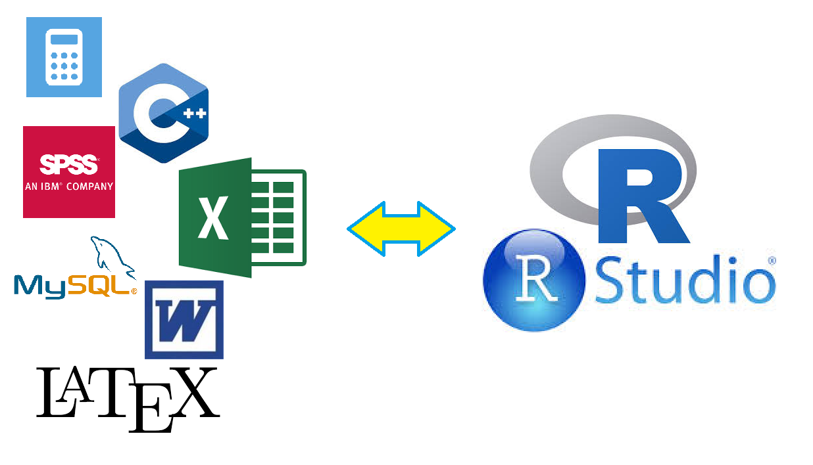
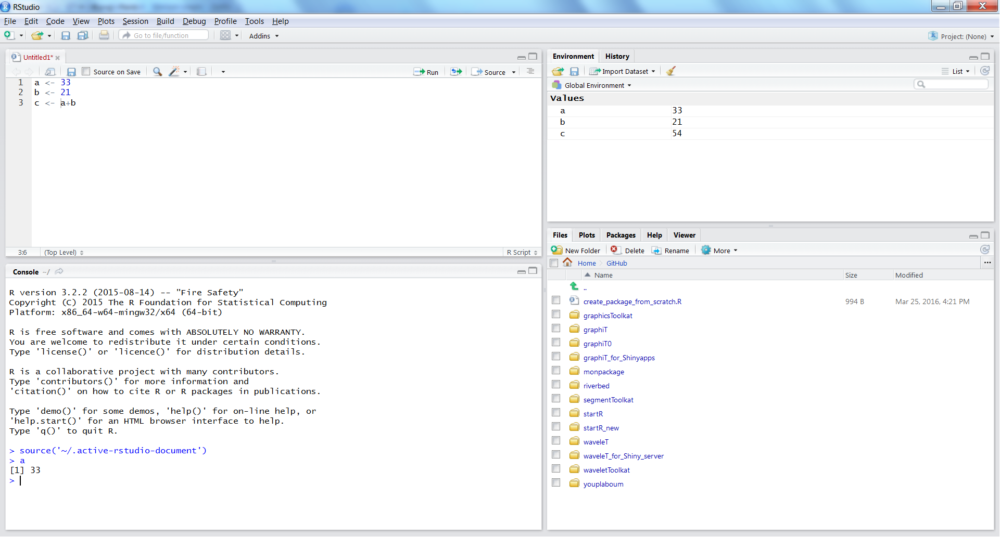
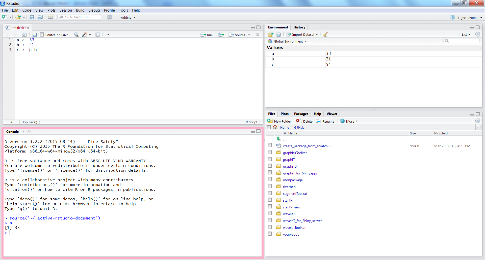
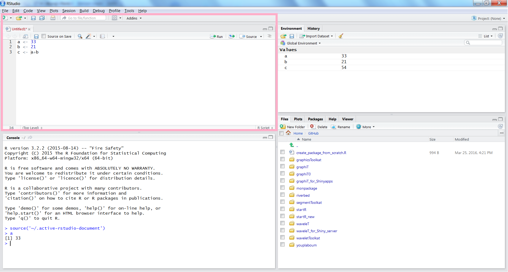
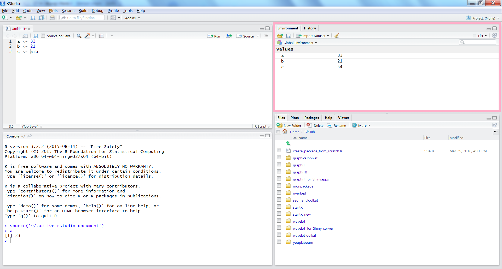
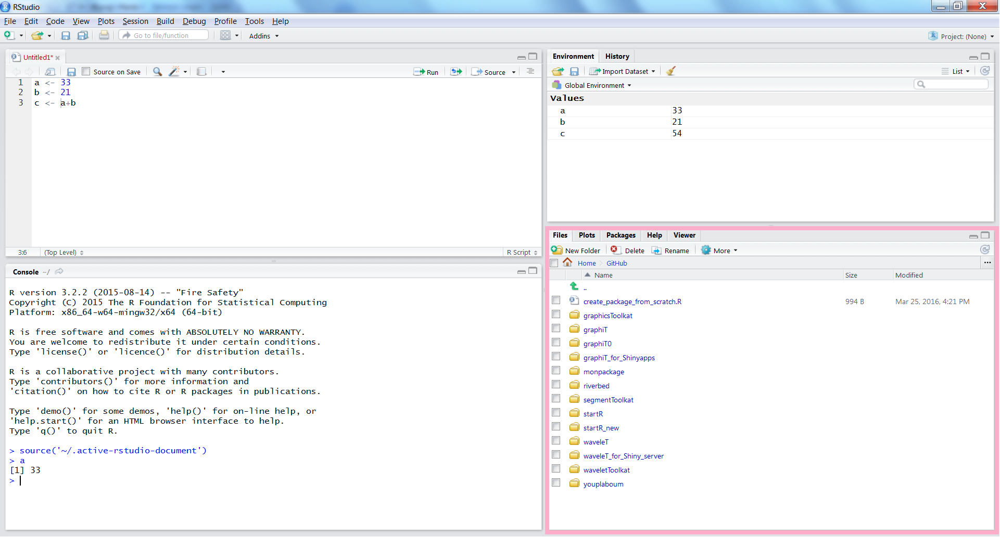
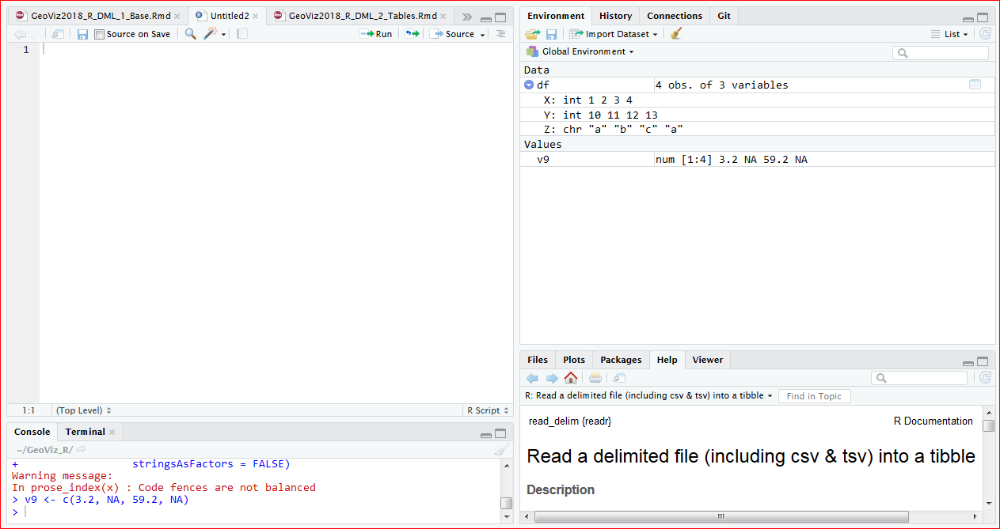
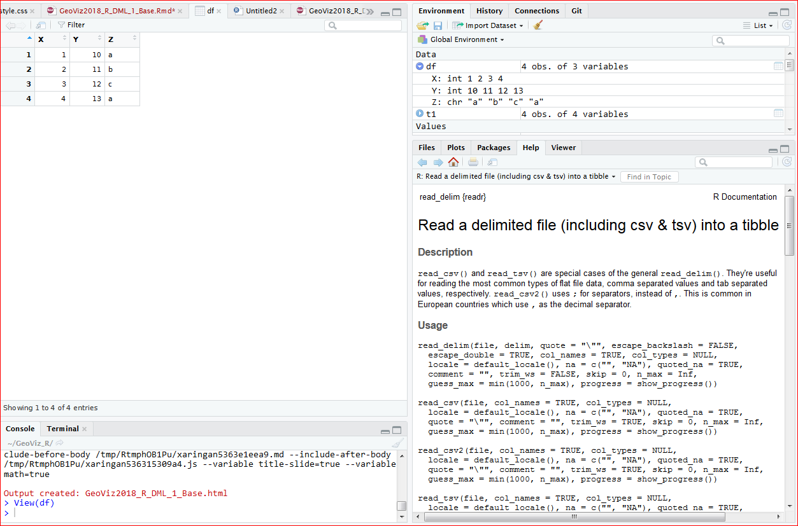
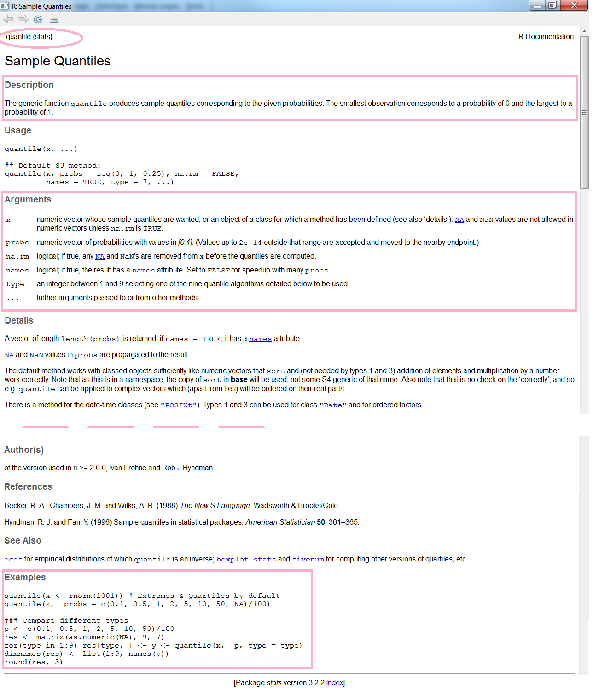

```{r xaringan-themer, include = FALSE}
library(dplyr)
library(xaringan)
library(xaringanthemer) # devtools::install_github("gadenbuie/xaringanthemer")
duo(
  primary_color = "#1F4257",
  secondary_color = "#F97B64",
  header_font_google = google_font("Josefin Sans"),
  text_font_google   = google_font("Montserrat", "300", "300i"),
  code_font_google   = google_font("Droid Mono"),
  outfile = "www/xaringan-themer.css"
)
library(knitr)
opts_chunk$set(cache = TRUE,
               cache.lazy = FALSE)
```
## Sommaire
.pull-left[
Environnement R
- [Organisation de RStudio](#rstudio)
- [Assignation de variables](#assignation)
- [Afficher un objet](#afficher-objet)
- [Les classes d'objets](#classes-objets)
- [Les fonctions](#fonctions)
- [Les packages](#packages)

Les opérateurs
- [Opérateurs arithmétiques](#operateurs-arithmetiques)
- [Opérateurs de comparaison](#operateurs-comparaison)
- [Opérateurs logiques](#operateurs-logiques)
- [Indicateurs statistiques](#indicateurs-stats)
]

.pull-right[
Manipuler des vecteurs
- [Créer un vecteur](#creer-vecteur)
- [Créer un facteur](#creer-facteur)
- [Conversion de vecteurs](#conversion-objets)
- [Les valeurs manquantes](#valeurs-manquantes)

Manipuler des tableaux
- [Créer des tableaux](#creer-tableaux)
- [Indexation en R](#indexation-objets)
- [Les structures de données](#structure-donnees)
- [Afficher un tableau](#afficher-tableau)
]

---
# Pourquoi utiliser le logiciel R?

.pull-left[
Le langage R est un **langage de programmation** et un **environnement mathématique** utilisé pour le **traitement de données** et l'**analyse statistique**.

Il est en outre d'utilisation **libre** et **gratuite** et peut être téléchargé par exemple à l'adresse suivante: http://cran.r-project.org/

L'installation prend au plus quelques minutes.

]

.pull-right[
Il permet de réaliser

- des **calculs arithmétiques** 
- de la **manipulation de données** 
- une très large variété de **graphiques** 
- des **scripts** (automatisation de traitements)
- de la **modélisation** et des **simulations numériques**
- une très large variété de **traitements statistiques** (c'est ce pour quoi il est le plus reconnu)
- des **rapports**, **pages web**, **aplications interactives** et **diaporamas**
]

---
# Pourquoi utiliser le logiciel R?

.pull-left[
Il peut donc remplir les fonctions 

- d'une **calculatrice**, 
- d'un **tableur**, 
- d'un **langage de programmation**, 
- d'un **logiciel de statistiques**,
- d'un **logiciel de dessin** 
- d'un **éditeur de rapports et de présentations**...
]


.pull-right[

]


En contrepartie de sa polyvalence et de sa flexibilité, R peut être un peu déroutant au premier abord, car il ne s'agit pas d'un logiciel "clic-boutons": on exécute les différentes opérations à travers l'exécution de **lignes de commande**.

- Pour simplifier l'usage de ce langage, on le mobilise au sein d'un **IDE** adapté : **RStudio**

---
name: rstudio
# RStudio

- Nous allons travailler sur un éditeur de script (ou plus précisément un **IDE**, pour Integrated Development Environment) le logiciel **RStudio**. 

- Il est lui aussi **libre et gratuit** et peut être téléchargé à l'adresse suivante: http://www.rstudio.com/ide/. 


---

# RStudio: Fonctionnalités

.pull-left[
Dans RStudio, quatre zones apparaissent:

- **Source** en haut à gauche,
- **Console** en bas à gauche, 
- **Environnement** en haut à droite
- **Plots** en bas à droite
]

.pull-right[

]

---
# RStudio: zone Console

.pull-left[
La zone Console de RStudio correspond en fait à l'**interpréteur R de base**... C'est cette console qui s'ouvre quand vous lancez R (sans RStudio)... Simplement ici, la console est "enrobée" de différents outils pour vous aider à travailler...
]

.pull-right[ 

]
---
# RStudio: zone Source

.pull-left[
La zone **Source** constitue l'éditeur de code à proprement parler. C'est dans cette zone que vous allez écrire vos scripts. 

Les calculs sont exécutés dans la zone **Console**. On peut envoyer les codes de la zone "Source" vers la zone "Console"

- grâce au bouton **Run** (qui exécute la ou les lignes de commande sélectionnée(s)) 
- grâce au bouton **Source** (qui exécute l'ensemble des lignes de commande du script). 
]

.pull-right[ 

]

---
# RStudio: zone Environment/History

.pull-left[
- onglet **Environment**: il vous permet de consulter l'ensemble des objets de votre environnement
- onglet **History**: il vous permet de consulter l'historique de vos commandes (i.e. l'ensemble des commandes que vous avez exécutées depuis le lancement de votre session).
]

.pull-right[ 

]
---
# RStudio: zone Files/Plots/Packages/Help

.pull-left[
- onglet **Files**: il vous permet de naviguer dans vos dossiers et d'ouvrirs/renommer/supprimer vos fichiers.
- onglet **Plots**: c'est là que s'afficheront (par défaut) les graphiques produits. Il vous permet donc de vérifier d'un coup d'oeil vos sorties graphiques... 
- onglet **Packages**: vous montre l'ensemble des packages installés et chargés pour la session actuelle.
- onglet **Help**: vous pouvez y consulter les fichiers d'aide associés aux différentes fonctions de R.
]


.pull-right[ 

] 
    

---
# Console, commandes

.pull-left[
Au lancement de RStudio, une fenêtre (la **console**) apparaît: le symbole ">" indique que R est prêt à exécuter toute ligne de commande que nous allons lui fournir.


]

.pull-right[
Un exemple de **ligne de commande**:

```{r}
2+2
```

Taper entrée pour exécuter la commande. R exécute la commande et nous affiche le résultat.
]

---
# Commentaires, historique des commandes

.pull-left[
## Commentaires

```{r}
32.7*59.6 # multiplication
```

Les indications précédées du symbole **\#** sont des **commentaires**. Ils sont ignorés par R mais vous seront très utiles pour **annoter vos scripts**.

]


.pull-right[
## Historique

Si l'on exécute plusieurs lignes de commandes dans la console, on peut "récupérer" les **lignes de commandes précédemment exécutées** avec la flèche $\uparrow$ ou au contraire en récupérer de plus récentes avec $\downarrow$.
]

---
name: assignation
# Assignation

.pull-left[
Lorsque vous exécutez une commande, vous pouvez en observer le résultat directement dans la console:

```{r}
32.7*59.6 
53/59 
```
]

.pull-right[
Vous pouvez également choisir d'attribuer ce résultat à un **objet**, qui sera référencé comme une **variable**

```{r}
a <- 32.7*59.6 
b <- 53/59 
```

On dit qu'on **assigne une valeur à une variable**. On a ainsi créé les objets `a` et `b`.


]

---
# Assignation

**N.B.** : En R, l'assignation peut se faire avec le symbole `<-` ou `=`, qui sont équivalents.

```{r}
a = 32.7*59.6 
a <- 32.7*59.6 
```

On préférera l'opérateur `<-` qui est plus spécifique et donc non ambigu.

- En revanche, R est **sensible à la casse** donc les deux commandes suivantes créerons deux objets distincts!

```{r}
a <- 32.7*59.6 
A <- 32.7*59.6 
```

---
# Environnement

.pull-left[

```{r}
a <- 32.7*59.6 
b <- 53/59 
```

Lorsque vous exécutez les commandes ci-dessus, **rien ne s'affiche dans la console**. Cela ne signifie pas pour autant que rien ne s'est passé... Vous avez **créé les objets a et b**, qui font désormais partie de votre environnement de travail... 

]

.pull-right[

Rappelez-vous, ces objets apparaissent dans la zone **Environnement** de RStudio. Vous pouvez également afficher la liste des objets dans l'environnement global de la manière suivante:

```{r}
ls()
```
]

---
name: afficher-objet
# Affichage des objets

.pull-left[
Pour afficher la valeur des objets dans la console, plusieurs possibilités:

```{r}
a
print(a)
```

]

.pull-right[
Vous pourrez par la suite manipuler les objets de différentes façon... Par exemple, ici on peut les utiliser pour de simples opérations arithmétiques:


```{r}
a+b  # calcul puis affichage
c <- a+b # calcul et creation d'objet
print(c) # affichage
```
]


---
# Création d'objets

Nous avons vu dans la section précédente **comment créer des objets très simples** et comment les **assigner à un environnement**.

Il y a en fait une multitude de types d'objets possibles dans R. Ici nous allons aborder

- les **vecteurs**
- les **facteurs**
- les **tableaux de données**

---
name: creer-vecteur
# Création de vecteurs

On appelle **vecteur** toute **séquence d'éléments** de même type, par exemple: 


.pull-left[

v1 = {2.3, 3.6, 1.1, 2.4} 
 
v2 = {"Paris", "Lyon", "Rennes"}

ou v3 = {TRUE, FALSE, FALSE}
]

.pull-right[
En R, ces vecteurs s'écrivent: 

```{r}
v1 <- c(2.3, 3.6, 1.1, 2.4)
v1
v2 <- c("Paris", "Lyon", "Rennes")
v2
v3 <- c(TRUE, FALSE, FALSE)
v3
```
]

---
# Création de vecteurs

On peut également créer des vecteurs correspondant à: 


.pull-left[
- des **séquences de valeurs régulièrement espacées**


```{r}
# valeurs de 0 à 6
# par pas de 2
v4 <- seq(from = 0,
          to = 6,
          by = 2)
v4
# nombres entiers de 0 a 3
v5 <- 0:3
v5
```
]
.pull-right[
- des **séquences de valeurs répétées**

```{r}
# repetition de "date1" : 
# 2 fois
v6<-rep("date1", 2)
v6
# repetition du vecteur v6 :
# 2 fois
v7<-rep(v6, 2)
v7
```
]
---
name: classes-objets
# Classes des objets

.pull-left[
Les vecteurs peuvent être de classes différentes selon le type de valeurs qu'ils contiennent (mais toutes les valeurs d'un vecteur doivent être d'un même type). 


Ils peuvent par exemple être de mode

- **numérique** 
- **caractère** 
- **logique**/**booléen**, c'est à dire que les valeurs qu'ils contiennent sont de type vrai / faux (`TRUE` / `FALSE`).
]
.pull-right[

Par exemple, pour v1, v2, et v3:

```{r}
v1 <- c(2.3,3.6,1.1,2.4,2.5,10.2,5.1,2.0)
class(v1)
v2 <- c("Paris","Lyon","Marseille","Rennes","Montpellier")
class(v2)
v3 <- c(TRUE,FALSE,FALSE,TRUE,TRUE)
class(v3)
```
]
---
# Création de vecteurs

Remarquez que l'on peut aussi utiliser `c()` pour combiner plusieurs vecteurs:

```{r}
v4
v5
vglobal <- c(v4,v5)
vglobal
```
---

# Création de vecteurs

Si l'on tente quelque chose comme 

```{r}
v5
v6
vessai <- c(v5,v6)
vessai
```

R ne renvoie pas de message d'erreur, mais fait en sorte que toutes les valeurs de vessai soient d'un même type (des chaînes de caractère ici: voyez les guillemets autour des valeurs de `v5`).
---
name: valeurs-manquantes
# Valeurs manquantes

Il peut arriver que certaines valeurs d'un objet soient **non renseignées**. En R, ces valeurs s'écrivent `NA` (pour **N**ot **A**vailable).

Par exemple:

```{r}
v8 <- c(3.2, NA, 8.9, 42.3, 59.2, NA)
```

---
name: creer-facteur
#  Création de facteurs

Les facteurs ressemblent généralement à des vecteurs de mode caractère, à la nuance près qu'ils comprennent généralement plusieurs **niveaux** (`levels`), c'est-à-dire un ensemble fini de modalités possibles :

```{r}
f1 <- factor(c("val1", "val2", "val3", "val2", "val2", "val3"))
f1
levels(f1)
```

La nuance entre vecteurs et facteurs est importante pour un certain nombre de fonctions implémentées dans R, il est donc assez souvent nécessaire de convertir les vecteurs en facteurs et inversement.

---
name: creer-tableaux
# Création d'objets: tableaux de données

Un tableau de données, ou `data.frame`, compte **plusieurs lignes et colonnes**.
Les colonnes (ou **variables**) d'un tableau de données **peuvent être de types différents**, et sont **nommées**.
Au sein d'une colonne, toutes les valeurs doivent être de même type.

|Espece|Nom|Date|Parle|
|------|---|---|---|
|Chien|Lassie|1940|Non|
|Dauphin|Flipper|1964|Non|
|Chat|Garfield|1978|Oui|
|Eponge|Bob|1999|Oui|
]

---
# Création d'objets: tableaux de données

Voici comment créer un tableau de données (`data.frame`) sous R, en assemblant plusieurs vecteurs de même taille:

```{r}
Espece <- c("Chien", "Dauphin", "Chat", "Eponge")
Nom <- c("Lassie", "Flipper", "Garfield", "Bob")
Date <- c(1940, 1964, 1978, 1999)
Parle <- c(FALSE, FALSE, TRUE, TRUE)
t1 <- data.frame(Espece, Nom, Date, Parle)
t1
```


---
name: conversion-objets
# Création d'objets, conversion d'objets

Pour interroger R quant au type (vecteur, facteur, tableau, matrice, etc.) ou au mode (numérique, caractère, logique, etc.) d'un objet, on utilise les fonctions de type `is.___`. 

Par exemple:

```{r}
v6
is.factor(v6)
is.character(v6)
```

---

# Création d'objets, conversion d'objets

On peut convertir un objet d'un type ou mode à un autre en utilisant les fonctions de type `as.___`. Par exemple,

```{r}
v6f <- as.factor(v6)
v6f
```         

convertit le vecteur v6 en facteur pour créer `v6f`.

---
name: indexation-objets
# Indexation d'un vecteur ou d'un facteur

On peut s'intéresser à une partie d'un objet, par exemple un ou plusieurs éléments d'un vecteur ou d'un facteur.

On a accès au $i^{eme}$ élément d'un vecteur/facteur par la commande: `v[i]`

Par exemple:
```{r}
v2
v2[4]
```
---
# Indexation d'un vecteur ou d'un facteur

On peut s'intéresser à une partie d'un objet, par exemple un ou plusieurs éléments d'un vecteur ou d'un facteur.

On a accès au $i^{eme}$ élément d'un vecteur/facteur par la commande: `v[i]`

Par exemple:
```{r}
v2[1:3]  # les trois premières valeurs
v2[c(2,4,5)] # les valeurs 2, 4 et 5
```

---
class: center, middle

# ** Attention !** : dans R, l'indexation commence à `1` et non pas à `0`.

---
# Indexation d'un vecteur ou d'un facteur

Pour un facteur:
```{r}
f1
f1[3:4]
```
Remarquez que dans les éléments n° 3 et 4 du facteur `f1`, il n'y a que la valeur "date1". Cependant, "date2" fait toujours partie des niveaux possibles de ce facteur!
---
# Indexation d'un tableau

Si l'on s'intéresse à l'élément d'un `data.frame` `"df"` qui se situe sur la $i^{eme}$ ligne et sur la $j^{eme}$ colonne, on y accède par: `df[i,j]`

```{r}
df <- data.frame(X = c(1:3),
                 Y = c(10:12),
                 Z = c("a", "b", "c"),
                 stringsAsFactors = FALSE)
df
```
---
# Indexation d'un tableau

Si l'on s'intéresse à l'élément d'un `data.frame` `"df"` qui se situe sur la $i^{eme}$ ligne et sur la $j^{eme}$ colonne, on y accède par: `df[i,j]`

```{r}
df[1,3] # la valeur sur la ligne 1 et la colonne 3
df[,3]  # toutes les valeurs sur la colonne 3
df[2,] # toutes les valeurs de la ligne 2
df[2,1:2] # les deux premieres valeurs de la ligne 2
```
---
# Indexation d'un tableau

Pour accéder à une colonne par son nom, on peut aussi utiliser l'opérateur `$` suivi du nom de la colonne :

```{r}
df
df$X
```
---

# Indexation d'un tableau

Ou encore, on peut utiliser des double crochets avec l'index ou bien le nom de la variable à laquelle on s'intéresse:

```{r}
df[[3]]
i <- 3
df[[i]]

df[["Z"]]
df$Z
```

---
name: operateurs-arithmetiques
# Opérateurs arithmétiques

Ils permettent d'effectuer des opérations arithmétiques simples, comme des additions, des multiplications,etc.

```{r}
v1
```
.small[
```{r}
v1 + 4 # addition
v1 - 3 # soustraction
v1 * 5 # multiplication
v1 / 4 # division
v1^2 # puissance
```
]
---
name: operateurs-comparaison
# Opérateurs de comparaison

Ils permettent de **comparer** des vecteurs entre eux.

.pull-left[
.small[
```{r}
v0 <- v1[1:3]
v0
```

```{r}
v0 == 3.6 # égal à
v0 != 2.3   # différent de
```
]
]
.pull-right[
.small[
```{r}
v0 < 4  # plus petit
v0 > 10 # plus grand
v0 <= 5 # plus petit ou égal
v0 >= 3 # plus grand ou égal
```
]
]
---
name: operateurs-logiques
# Opérateurs logiques

Ils permettent de **vérifier si une proposition est vraie** ou non.

.pull-left[

```{r}
v0
```

```{r}
!(v0 > 3)    # NON logique


v0 < 2 & v0 > 5 # ET logique
v0 < 3 | v0 > 5 # OU logique
```
]

.pull-right[
Noter également l'existence de la fonction `is.na()` qui permet d'évaluer si les éléments d'un vecteur sont vides ou non

```{r}
v9 <- c(3.2, NA, 59.2, NA)
is.na(v9)
```
]


---
name: structure-donnees
# Description des variables: Structure des données

Dans R, un ensemble de fonctions permet d'afficher la **structure**, le **type**, le **contenu** ou encore les **dimensions** d'un objet

.pull-left[
.small[
```{r}
v9 <- c(3.2, NA, 59.2, NA)
v9
print(v9)
str(v9)
class(v9)
length(v9)
```
]
]

.pull-right[
.small[
```{r}
df <- data.frame(X = c(1:4), Y = c(10:13),
                 Z = c("a", "b", "c", "a"),
                 stringsAsFactors = FALSE)
str(df)
class(df)
dim(df)
unique(df$Z)

```
]
]
---
# Description des variables: Structure des données

- 0n peut aussi se référer à l'interface graphique de RStudio :



---
name: afficher-tableau
# Description des variables: Structure des données

- Et pour les `data.frame`, à la fonction `View()`, qui affiche un tableau interactif dans l'interface :

```{r, eval = FALSE}
View(df)
```
.center[

]
---
name: indicateurs-stats
# Description des variables: Indicateurs statistiques

Soit `x` une variable aléatoire suivant une loi normale (`rnorm`) d'espérance (`mean`) 10 et d'écart-type (`sd`) 3 
.small[
```{r}
x <- round(rnorm(n = 15, mean = 10, sd = 3), digits = 1) 
```
]
.pull-left[
.small[
```{r}
mean(x)
median(x)
min(x)
max(x)
```
]
]

.pull-right[
.small[
```{r}
var(x)
sd(x)
IQR(x)
summary(x)
```
]
]

---

# Description des variables: Indicateurs statistiques

**N.B.** : Ces fonctions sont aussi valables pour les colonnes d'un `data.frame` :
.small[
```{r}
df <- data.frame(X = c(1:4),
                 Y = c(10:13),
                 Z = c("a", "b", "c", "a"),
                 stringsAsFactors = FALSE)
```
]
.pull-left[
.small[
```{r}
mean(df$X)
median(df$Y)
min(df[,c(1,2)])
max(df[,c(1,2)])
```
]
]

.pull-right[
.small[
```{r}
summary(df$X)
summary(df)
```
]
]
---
# Description des variables: Indicateurs statistiques

- Pour décrire un `data.frame`, des fonctions spécifiques sont disponibles
.small[
```{r}
df <- data.frame(X = c(1:10),
                 Y = c(30:21),
                 Z = rep(c("a", "b", "c", "a", "c"), 2),
                 stringsAsFactors = FALSE)
```
]
.pull-left[
.small[
```{r}
nrow(df) # Nombre de lignes (row)
ncol(df) # Nombre de colonnes (col)
colnames(df) # Nom des colonnes
```
]
]

.pull-right[
.small[
```{r}
head(df) # 5 premières lignes
tail(df) # 5 dernières lignes
```
]
]
---
name: fonctions
# Fonctions: remarques

.pull-left[
Nous avons d'ores et déjà utilisé un certain nombre de fonctions, comme 

- **c()**, 
- **seq()**, 
- **rep()**, 
- **data.frame()**, 
- **mean()**, etc.

Toutes les fonctions que nous avons utilisées jusqu'à présent sont définies sur le **package de base** de R. 

]
.pull-right[
Les fonctions sont des **objets** qui s'écrivent avec des **parenthèses**, dans lesquelles l'utilisateur précise la **valeur des arguments** si besoin est.
Ces arguments peuvent être **obligatoires** ou **optionnels** :
.small[
```{r}
quantile(x = x, probs = 0.1)
```
]

L'argument `x` est obligatoire, et l'argument `probs` est optionnel. On peut ainsi ne passer que l'argument `x` à la fonction:
.small[
```{r}
quantile(x = x)
```
]           
]
---
# Fonctions: remarques

Si l'on passe les arguments à la fonction **dans le bon ordre**, on n'a pas besoin de préciser le nom des arguments. Ainsi, il est possible d'appeler la fonction `quantile` des deux manières suivantes:

```{r}
quantile(x = x, probs = 0.1)
quantile(x, 0.1)
```

En revanche, l'appel suivant produira une erreur:

```{r, error=TRUE}
quantile(0.1,x)
```

---
# Fonctions: remarques

Pour accéder aux **informations** quant aux **arguments** d'une fonction, on peut consulter l'aide associée des deux façons suivantes:

```{r, eval=FALSE}
help(quantile)
?quantile
```
.pull-left[

]
.pull-right[

]

]
---
name: packages
# Packages

Les packages sont des **paquets de fonctions** visant à réaliser des tâches un peu particulières. L'installation de base de R vous installe, par défaut, un certain nombre de packages (`base`, `methods`, `stats`, `graphics`, etc.)

Dans la suite de ce cours, nous serons amenés à utiliser le package `dplyr` qui sert à manipuler des tableaux de données.


Pour être en mesure d'utiliser les fonctions de ce package, il faut:

- **Installer le package**: les fonctions du package sont alors téléchargées depuis un serveur distant et enregistrées sur le disque dur de votre ordinateur:

```{r, eval=FALSE}
install.packages("dplyr")
```

- **Charger le package** (les fonctions du package sont chargées dans l'environnement R pour la session en cours)

```{r, eval=FALSE}
library(dplyr)  
```

