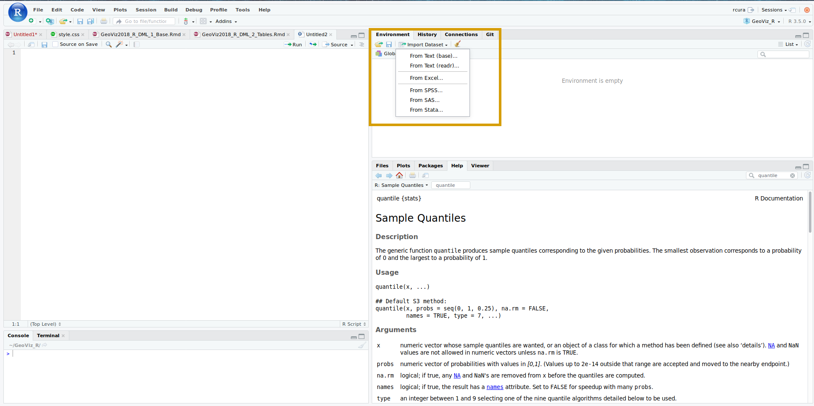
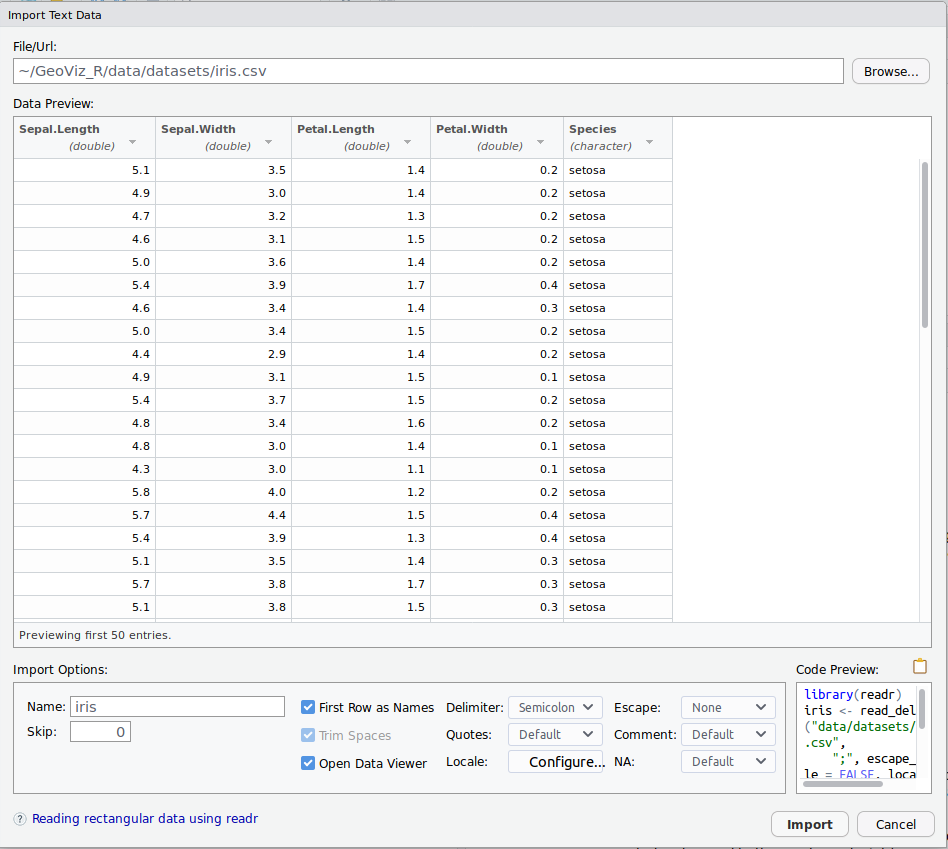
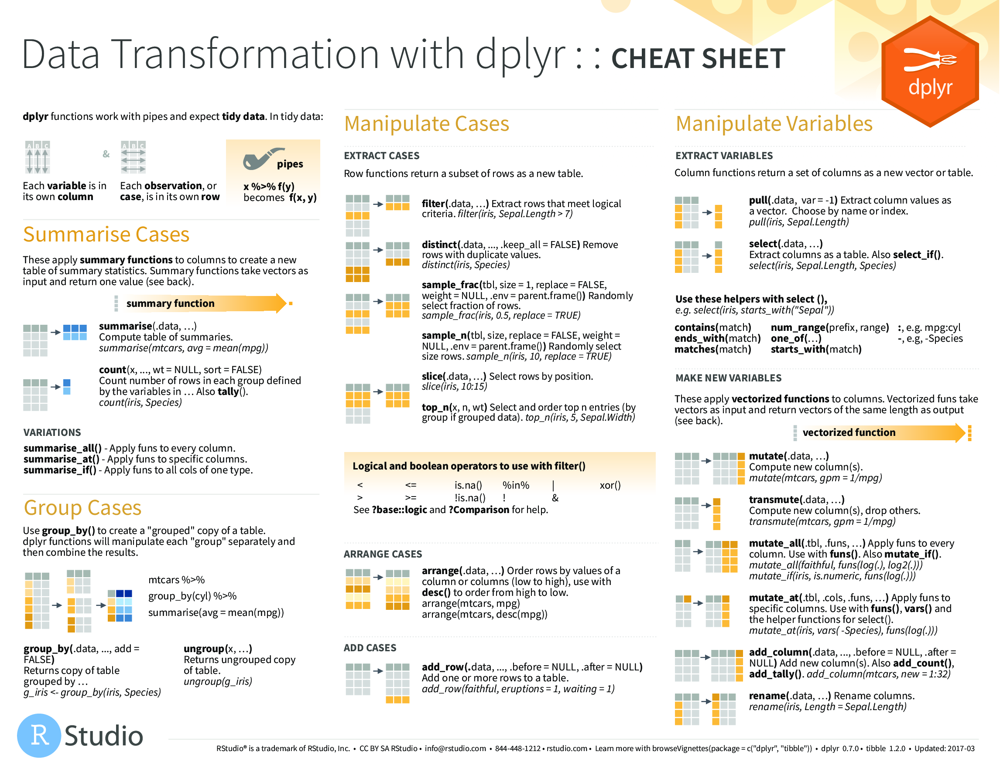
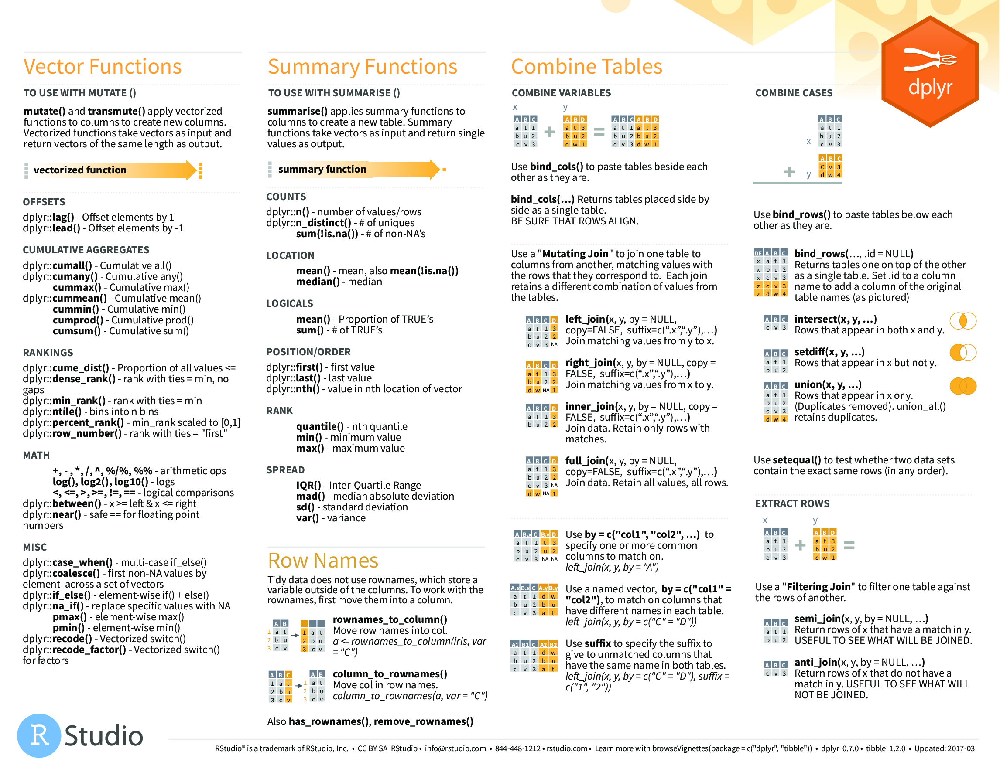

```{r xaringan-themer, include = FALSE}
library(tidyverse)
library(xaringan)
library(xaringanthemer) # devtools::install_github("gadenbuie/xaringanthemer")
duo(
  primary_color = "#1F4257",
  secondary_color = "#F97B64",
  header_font_google = google_font("Josefin Sans"),
  text_font_google   = google_font("Montserrat", "300", "300i"),
  code_font_google   = google_font("Droid Mono"),
  outfile = "www/xaringan-themer.css"
)
library(knitr)
opts_chunk$set(cache = TRUE,
               cache.lazy = FALSE)
```
## Sommaire
.pull-left[
Entrées / sorties
- [Charger un tableau](#lecture-table)
- [Enregistrer un tableau](#enregistrer-tableau)
- [Le tidyverse, un ensemble de packages pour la manipulation de tableaux](#tidyverse)
- [Organiser l'enchaînement des opérations avec les *pipes*](#pipes)

[Manipulation de données](#manipulation-donnees)
- [Sélection de variables](#select)
- [Filtrage de lignes](#filter)
- [Tri d'un tableau](#arrange)
]

.pull-right[
[Modifier un tableau](#modification-tableau)
- [Renommage de variables](#rename)
- [Création/modification de variables](#mutate)
- [Modifications conditionelles](#ifelse)
- [Agrégations de données](#agregation)
- [Jointures de données](#jointures)
- [Restructuer un tableau](#restructurer-tableau)
- [Diviser des colonnes](#separate)
- [Compléter des données](#complete)

Autre :
- [Un exercice complet d'application](#exercice)
- [Trouver de la documentation](#supports)
]


---
name: lecture-table
## Lecture de tables : `readr`

- RStudio dispose d'un outil graphique pour importer des données :



---

## Lecture de tables : `readr`

- RStudio dispose d'un outil graphique pour importer des données :
.center[

]
---

## Lecture de tables : `readr`

- L'interface graphique génère un code que l'on peut copier/coller dans ses scripts, mais on peut aussi écrire le code correspondant directement :
  - On commence par charger le *package* `readr` :
  ```{r, eval = FALSE}
  library(readr)
  ``` 
  ```{r, eval = TRUE, echo = FALSE}
  library(readr)
  ```
  - On peut alors choisir entre les différentes fonctions du package :
      - `read_csv()` : lecture d'un csv séparé par des virgules (`,`), format numérique anglais (`.`)
      - `read_csv2()` : lecture d'un csv séparé par des points-virgules (`;`), format numérique français (`,`)
      - `read_delim()` : fonction plus générique et paramétrable, pour lire des fichiers délimités plus spécifiques (délimité par des tabulations, contenant des caractères spéciaux etc.)
          - Pour comprendre les arguments : `?read_delim`
---

## Lecture de tables : `readr`

On va ouvrir et lire la table de données `dans_ma_rue.csv` :
.small[
```{r}
library(readr)
df_dmr <- read_delim("data/dans-ma-rue.csv",
                     delim = ";",
                     escape_double = FALSE,
                     trim_ws = TRUE)

```
]

- Un message indique les colonnes et les types qui leur ont été attribuées automatiquement.
---
## Lecture de tables : `readr`

.small[
```
## Parsed with column specification:
## cols(
##   TYPE = col_character(),
##   SOUSTYPE = col_character(),
##   ADRESSE = col_character(),
##   CODE_POSTAL = col_integer(),
##   VILLE = col_character(),
##   ARRONDISSEMENT = col_double(),
##   DATEDECL = col_datetime(format = ""),
##   `ANNEE DECLARATION` = col_integer(),
##   `MOIS DECLARATION` = col_integer(),
##   NUMERO = col_double(),
##   PREFIXE = col_character(),
##   INTERVENANT = col_character(),
##   `CONSEIL DE QUARTIER` = col_character(),
##   OBJECTID = col_integer(),
##   geo_shape = col_character(),
##   geo_point_2d = col_character()
## )
```
]

- On remarque tout de suite plusieurs problèmes :
    - Le code postal a été interpreté comme un `integer`, ce qui peut être gênant
    - Certaines colonnes contiennent des espaces (`ANNEE DECLARATION`)
        - Dans ce cas, on encadre le nom de la colonne avec des "backticks", i.e. **"\`"** (Alt Gr + 7)
    - L'information spatiale est contenue dans deux colonnes (`geo_shape` et `geo_point_2d`) peu explicites

---
## Lecture de tables : `readr`

- Quand on lit une table avec `readr`, l'objet retourné est un `tibble` (`tbl`):
```{r}
class(df_dmr)
```

- L'affichage des `tibbles` est plus condensé et explicite, et ce format simplifie la gestion, en particulier pour la manipulation avec `dplyr` :
.small[
```{r}
df_dmr
```
]

---
name: manipulation-donnees

## Manipuler des données avec `dplyr`

- Avant de vouloir modifier le jeu de données chargé, voyons déjà comment manipuler son contenu
- On utilise pour cela le *package* `dplyr`, et notamment 3 fonctions :
    - #### `select()` permet de **sélectionner** des **variables** (colonnes)
    - #### `filter()` permet de **filtrer** les **individus** (lignes)
    - #### `arrange()` permet de **réarranger le tableau selon l'ordre des variables**

On commence toujours par charger le **package** :
```{r}
library(dplyr)
```

---
name: select
## dplyr: select()

.center[

]

**select()** permet de **sélectionner des variables**

Par exemple, on peut sélectionner des variables de la table `df_dmr` :
.small[
```{r}
print(df_dmr)
```
]
---
## dplyr: select()

.center[

]

**select()** permet de **sélectionner des variables**

Par exemple, on peut sélectionner des variables de la table `df_dmr` :
- **Par leur nom**
.small[
```{r}
select(df_dmr, TYPE, SOUSTYPE, CODE_POSTAL)
```
]
---
## dplyr: select()
.center[

]

**select()** permet de **sélectionner des variables**

Par exemple, on peut sélectionner des variables de la table `df_dmr` :
- Par leur nom, **par leur numéro**
.small[
```{r}
select(df_dmr, 3:7)
```
]
---
## dplyr: select()
.center[

]

**select()** permet de **sélectionner des variables**

Par exemple, on peut sélectionner des variables de la table `df_dmr` :
- Par leur nom, par leur numéro, **en excluant des variables**
.small[
```{r}
select(df_dmr, -(4:7), - SOUSTYPE)
```
]
---
## dplyr: select()
.center[

]

**select()** permet de **sélectionner des variables**

Par exemple, on peut sélectionner des variables de la table `df_dmr` :
- Par leur nom, par leur numéro, en excluant des variables, ou avec des **fonctions de sélection** :
    - `starts_with()` pour les variables qui **commencent** par un texte donné
    - `ends_with()` pour les variables qui **terminent** par un texte donné
    - `contains()` pour les variables qui **contiennent** un texte donné

---
## dplyr: select()
.small[
```{r}
colnames(df_dmr)
select(df_dmr, starts_with("A"))
```
]
---
## dplyr: select()
.small[
```{r}
colnames(df_dmr)
select(df_dmr, ends_with("DECLARATION"))
```
]
---
## dplyr: select()
.small[
```{r}
colnames(df_dmr)
select(df_dmr, contains("TYPE"))
```
]
---
name: filter
## dplyr: filter()
.center[

]

**filter()** permet de **filtrer les lignes du tableau** en fonction des valeurs de telle ou telle variable.

.small[
```{r}
nrow(df_dmr)
df_dmr_paris6 <- filter(df_dmr, CODE_POSTAL == 75006)
nrow(df_dmr_paris6)
head(df_dmr_paris6)
```
]

---
## dplyr: filter()
.center[

]

**filter()** permet de **filtrer les lignes du tableau** en fonction des valeurs de telle ou telle variable.

- On peut **combiner plusieurs conditions logiques** :
    - **ET** logique, par une virgule ou un `&`,
    - **OU** logique, par l'opérateur `|`,
    - **NON** logique par l'opérateur `!`).
    
---
## dplyr: filter()
.small[
```{r}
nrow(df_dmr)
filter(df_dmr, CODE_POSTAL == 75006 & `ANNEE DECLARATION` == 2018)
nrow(filter(df_dmr, CODE_POSTAL == 75006, `ANNEE DECLARATION` == 2018))
```
]
---
## dplyr: filter()
.small[
```{r}
nrow(df_dmr)
filter(df_dmr, CODE_POSTAL == 75006 | CODE_POSTAL == 75007)
```
]
---
## dplyr: filter()
.small[
```{r}
nrow(df_dmr)
filter(df_dmr, !(CODE_POSTAL == 75006))
```
]
---
## dplyr: filter()
.small[
```{r}
nrow(df_dmr)
# L'opérateur %in% permet de chercher parmi les valeurs d'un vecteur
filter(df_dmr, CODE_POSTAL %in% c(75006, 75008)) 
```
]
---
name: arrange
## dplyr: arrange()
.center[

]

Pour trier un tableau selon l'ordre d'une variable (réarranger les lignes d'un tableau), on peut faire appel à la fonction `arrange` : 

.pull-left[
.tiny[
```{r}
df_dmr
```
]
]

.pull-right[
.tiny[
```{r}
arrange(df_dmr, CODE_POSTAL)
```
]
]
---
## dplyr: arrange()
.center[

]

On peut aussi trier un `tibble` par plusieurs variables

.pull-left[
.tiny[
```{r}
arrange(df_dmr, CODE_POSTAL)
```
]
]

.pull-right[
.tiny[
```{r}
arrange(df_dmr, CODE_POSTAL, TYPE)
```
]
]
---
## dplyr: arrange()
.center[

]

On peut aussi trier un `tibble` par plusieurs variables, et par ordre décroissant avec `desc()`

.pull-left[
.tiny[
```{r}
arrange(df_dmr, CODE_POSTAL, TYPE)
```
]
]

.pull-right[
.tiny[
```{r}
arrange(df_dmr, desc(CODE_POSTAL), TYPE)
```
]
]
---
name: pipes
## Enchaîner des opérations

Si on veut ré-organiser un tableau avec plusieurs opérations, on peut procéder de plusieurs manières :
  - En mettant chaque étape dans une variable
.small[
```{r}
tableau_reorganise <- select(df_dmr, TYPE, CODE_POSTAL, `ANNEE DECLARATION`)
tableau_reorganise <- filter(tableau_reorganise, CODE_POSTAL %in% c(75006, 75008))
tableau_reorganise <- arrange(tableau_reorganise, desc(`ANNEE DECLARATION`), TYPE)
tableau_reorganise
```
]
---
## Enchaîner des opérations

Si on veut ré-organiser un tableau avec plusieurs opérations, on peut procéder de plusieurs manières :
  - En mettant chaque étape dans une variable -> **risque d'erreur important**
  - En imbriquant les opérations...
.small[
```{r}
arrange(
  filter(
    select(df_dmr,
           TYPE, CODE_POSTAL, `ANNEE DECLARATION`),
    CODE_POSTAL %in% c(75006, 75008)),
  desc(`ANNEE DECLARATION`, TYPE)
  )
```
]
---
## Enchaîner des opérations

Si on veut ré-organiser un tableau avec plusieurs opérations, on peut procéder de plusieurs manières :
  - En mettant chaque étape dans une variable -> **risque d'erreur important**
  - En imbriquant les opérations... -> **c'est illisible**
.small[
```{r}
arrange(
  filter(
    select(df_dmr,
           TYPE, CODE_POSTAL, `ANNEE DECLARATION`),
    CODE_POSTAL %in% c(75006, 75008)),
  desc(`ANNEE DECLARATION`, TYPE)
  )
```
]
---
## Enchaîner des opérations

Si on veut ré-organiser un tableau avec plusieurs opérations, on peut procéder de plusieurs manières :
  - En mettant chaque étape dans une variable -> **risque d'erreur important**
  - En imbriquant les opérations... -> **c'est illisible**
  - En utilisant un **opérateur de chaînage**, le **pipe** : `%>%`
.small[
```{r}
df_dmr$CODE_POSTAL %>% mean() %>% log()
log(mean(df_dmr$CODE_POSTAL))
```
]
---
## Enchaîner des opérations

Si on veut ré-organiser un tableau avec plusieurs opérations, on peut procéder de plusieurs manières :
  - En mettant chaque étape dans une variable -> **risque d'erreur important**
  - En imbriquant les opérations... -> **c'est illisible**
  - En utilisant un **opérateur de chaînage**, le **pipe** : `%>%`
.small[

```{r, eval = FALSE}
tableau_reorganise <- select(df_dmr, TYPE, CODE_POSTAL, `ANNEE DECLARATION`)
tableau_reorganise <- filter(tableau_reorganise, CODE_POSTAL %in% c(75006, 75008))
tableau_reorganise <- arrange(tableau_reorganise, desc(`ANNEE DECLARATION`), TYPE)
```

]

peut être écrit :

.small[
```{r, eval = FALSE}
tableau_reorganise <- df_dmr %>%
    select(TYPE, CODE_POSTAL, `ANNEE DECLARATION`) %>%
    filter(CODE_POSTAL %in% c(75006, 75008)) %>%
    arrange(desc(`ANNEE DECLARATION`), TYPE)
```

]

**N.B** : Attention, le premier argument des fonctions (le tableau) est ici implicitement communiqué par le **pipe**

---
name: modification-tableau
## Modifier un tableau de données avec `dplyr`

Ré-organiser des données ne suffit généralement pas pour les adapter à une représentation, il faut alors **modifier le tableau de données** en entrée :

- #### `rename()` permet de **renommer** des colonnes
- #### `mutate()` permet de **créer et ajouter de nouvelles variables** (colonnes)
- #### `group_by()` permet de réaliser **des agrégations**
- #### `summarise()` permet de **calculer un résumé statistique**, en particulier au cours de la création d'un tableau agrégé par `group_by()` 
- #### `left_join()`, `inner_join()` etc. permettent de réaliser des **jointures**

---
name: rename

## Renommer des colonnes avec `rename`

Pour simplifier ou modifier des noms de colonnes :

.small[
```{r}
colnames(df_dmr)
df_dmr_renamed <- rename(df_dmr, ANNEE_DECLARATION = `ANNEE DECLARATION`)
colnames(df_dmr_renamed)
```
]

---
## Renommer des colonnes avec `rename`

On peut aussi renommer plusieurs colonnes d'un coup :

.small[
```{r}
df_dmr_renamed <- rename(df_dmr,
                         ANNEE_DECLARATION = `ANNEE DECLARATION`,
                         MOIS_DECLARATION = `MOIS DECLARATION`)
colnames(df_dmr_renamed)
```
]

Et même utiliser des fonctions pour renommer automatiquement (plus complexe), par exemple en manipulant les chaînes de cractères avec le **package** `stringr` :

.small[
```{r, eval = FALSE}
library(stringr)
df_dmr_renamed <- rename_at(.tbl = df_dmr,
                            .vars = vars(contains(" ")),
                            .funs = funs(str_replace_all(string = .,
                                                         pattern = " ",
                                                         replacement = "_")))
```

```{r, echo=FALSE}
library(stringr)
```
]

---
## Renommer des colonnes avec `rename`

.small[
```{r, eval = TRUE}
df_dmr_renamed <- rename_at(.tbl = df_dmr,
                            .vars = vars(contains(" ")),
                            .funs = funs(str_replace_all(string = .,
                                                         pattern = " ",
                                                         replacement = "_")))
colnames(df_dmr_renamed)
```
]

-> On renomme toutes (`rename_at`) les colonnes qui contiennent un espace (`vars(contains(" "))`), par un appel de fonctions (`funs` ici) qui remplace tous (`str_replace_all()`) les espaces (`pattern = " "`) par des underscores (`replacement = "_"`).

---
## Renommer des colonnes avec `rename`

On peut à nouveau enchaîner les opérations pour disposer d'une chaîne de renommage claire et ré-utilisable :

.small[
```{r, eval = TRUE}
df_dmr_renamed <- df_dmr %>%
  rename_at(.vars = vars(contains(" ")),
            .funs = funs(str_replace_all(string = ., pattern = " ", replacement = "_"))) %>%
  rename_all(funs(toupper(.)))
colnames(df_dmr_renamed)
```
]

---
name: mutate
## Créer et modifier des colonnes avec `mutate`
.center[

]

Pour créer de nouvelles variables et les ajouter au tableau de données on peut utiliser la fonction **mutate()**.

Voici par exemple comment procéder si je souhaite créer une nouvelle variable, "`DATE_DECLARATION`", en combinant les variables `ANNEE_DECLARATION` et `MOIS_DECLARATION` à l'aide de la fonction `paste()` (concaténation)
.small[
```{r}
df_dmr_renamed_muted <- df_dmr_renamed %>%
  mutate(DATE_DECLARATION = paste(ANNEE_DECLARATION, MOIS_DECLARATION, sep = "-"))
head(df_dmr_renamed_muted$DATE_DECLARATION)
```
]

---
## Créer et modifier des colonnes avec `mutate`
.center[

]

- On peut aussi modifier des variables existantes :

.small[
```{r}
df_dmr_renamed_muted <- df_dmr_renamed %>%
  mutate(CODE_POSTAL = as.character(CODE_POSTAL))
```
]
.pull-left[
.smaller[
```{r}
df_dmr_renamed %>% select(3:5)
```
]
]

.pull-right[
.smaller[
```{r}
df_dmr_renamed_muted %>% select(3:5)
```
]
]


---
## Créer et modifier des colonnes avec `mutate`
.center[

]

- Un exemple de discrétisation d'une variable continue, ici avec la fonction `cut()`

.smaller[
```{r}
df_dmr_renamed_muted <- df_dmr_renamed_muted %>%
  mutate(TRIMESTRE_DECLARATION = cut(MOIS_DECLARATION,
                         breaks = c(0, 3, 6, 9, 12),
                         labels = c("Q1", "Q2", "Q3", "Q4")))
df_dmr_renamed_muted %>%
  select(MOIS_DECLARATION, TRIMESTRE_DECLARATION)
```
]

---
name: agregation
# Résumer avec `group_by` et `summarise`
.center[

]

Comme dans les tableaux croisés dynamiques des tableurs, il peut être utile de résumer l'information contenue dans une colonne en fonction d'une agrégation spécifique.
- Avec `dplyr`, la syntaxe de groupage ressemble à celle du `SQL` : `GROUP BY`
- Une fois le groupage effectué, on peut réaliser l'opération d'agrégation : moyenne (`mean()`), somme (`sum()`), compte (`n()`) etc...

---
# Résumer avec `group_by` et `summarise`
.center[

]

- Par exemple, on peut vouloir connaître le nombre de déclarations ayant été reportées chaque année :
.small[
```{r}
df_dmr_renamed_muted %>%
  group_by(ANNEE_DECLARATION) %>%
  summarise(NbDeclarations = n()) %>%
  arrange(ANNEE_DECLARATION)
```
]

---
# Résumer avec `group_by` et `summarise`
.center[

]
- On peut mener cette agrégation en fonction de plusieurs variables
.small[
```{r}
df_dmr_renamed_muted %>%
  group_by(ANNEE_DECLARATION, TRIMESTRE_DECLARATION) %>%
  summarise(NbDeclarations = n()) %>%
  arrange(ANNEE_DECLARATION, TRIMESTRE_DECLARATION)
```
]

---
# Résumer avec `group_by` et `summarise`
.center[

]
- On peut aussi créer plusieurs résumés statistiques, et les enchaîner :
.small[
```{r}
df_dmr_renamed_muted %>%
  group_by(ANNEE_DECLARATION, ARRONDISSEMENT) %>%
  summarise(NbDeclarations = n()) %>%
  group_by(ARRONDISSEMENT) %>%
  summarise(NbDeclarationTotal = sum(NbDeclarations),
            NbDeclarationAnnuel = mean(NbDeclarations)) %>%
  head()
```
]

---
name: jointures
## Les jointures

`dplyr` simplifie la réalisation de jointures entre des tableaux, en suivant une syntaxe proche du `SQL`. Les fonctions les plus utiles sont :

- `left_join()` : **Jointure** qui ajoute les colonnes de `y` à celles de `x`, et conservent toutes les lignes de `x`
- `inner_join()` : **Jointure**  qui ajoutent les colonnes de `y` à celles de `x`, et ne conservent que les lignes de `x` et `y` qui sont présentes dans les deux tableaux
- `semi_join()` : **Jointure** qui ne conserve que les éléments de `x` présents dans `y`, et ne conserve que les colonnes de `x` : semblable à un filtre
- `union()` : **Union** des lignes uniques, avec suppression des doublons
- etc.

- #### Voir l'ensemble des opérations illustrées sur [https://github.com/gadenbuie/tidy-animated-verbs](github.com/gadenbuie/tidy-animated-verbs#union)

---
## `left_join()`

.center[

]

---
## `left_join()`

.small[

```{r}
total_arrondissement <- df_dmr_renamed_muted %>%
  group_by(CODE_POSTAL) %>%
  summarise(NbArrondissement = n())

df_dmr_renamed_muted %>%
  group_by(ANNEE_DECLARATION, CODE_POSTAL) %>%
  summarise(NbDeclarations = n()) %>%
  left_join(y = total_arrondissement,
            by = "CODE_POSTAL") %>%
  mutate(Pct_Declaration_Annee =
           NbDeclarations / NbArrondissement * 100
         ) %>%
  select(CODE_POSTAL,
         ANNEE_DECLARATION,
         Pct_Declaration_Annee)
  
```
]

---
## `inner_join()`

.center[

]
---
## `semi_join()`

.center[

]

---
## `union()`

.center[

]
  

---
name: restructurer-tableau
## Restructurer un tableau avec `tidyr`

Que ce soit pour des traitements ou pour restructurer les données en vue de leur (géo)visualisation, il est souvent utile de *passer de formats longs à des formats larges** et vice-versa

.center[
<br/>
.smaller[Tidy Animated Verbs - Garrick Aden-Buie - [github.com/gadenbuie/tidy-animated-verbs](https://github.com/gadenbuie/tidy-animated-verbs)]
]

- On effectue ces opérations avec le *package* `tidyr`
.small[
```{r}
library(tidyr)
```
]
---
## Restructurer un tableau avec `tidyr`

Que ce soit pour des traitements ou pour restructurer les données en vue de leur (géo)visualisation, il est souvent utile de **passer de formats longs à des formats larges** et vice-versa

.center[
<br/>
.smaller[Tidy Animated Verbs - Garrick Aden-Buie - [github.com/gadenbuie/tidy-animated-verbs](https://github.com/gadenbuie/tidy-animated-verbs)]
]

- De **large** à **long** : `gather()`
- De **long** à **large** : `spread()`

---
## Restructurer un tableau avec `tidyr`

Un exemple sur les années : on a actuellement un tableau où les incidents sont déclarés les uns après les autres.
On en a déjà fait un résumé par an et par arrondissement:

.small[
```{r}
resume_annuel <- df_dmr_renamed_muted %>%
  group_by(ANNEE_DECLARATION, CODE_POSTAL) %>%
  summarise(NbDeclarations = n())
resume_annuel
```
]

- Le résultat est au format long
- => Pour le passer au format large : `spread()`

---
## Restructurer un tableau avec `tidyr`

.small[
```{r}
head(resume_annuel)
resume_annuel_large <- resume_annuel %>%
  spread(key = ANNEE_DECLARATION, value = NbDeclarations)
head(resume_annuel_large)
```
]

-> On obtient un résultat plus lisible
---

## Restructurer un tableau avec `tidyr`

Pour repasser au format long :

.small[
```{r}
head(resume_annuel_large)
resume_annuel_large %>% gather(key = ANNEE, NbIncidents, -CODE_POSTAL) %>% head()
```
]

-> On regroupe toutes les colonnes sauf `CODE_POSTAL`, avec une nouvelle colonne `ANNEE` qui contiendra les anciens noms de colonnes, et une colonne `NbIncidents` qui contient les valeurs qui étaient renseignées dans chaque variable d'année. 

---
name: separate
## Diviser des colonnes avec `tidyr`

- Le tableau de données contient une variable actuellement inexploitable : `GEO_POINT_2D`
.small[
```{r}
df_dmr_renamed_muted %>% select(GEO_POINT_2D)
```
]

- => Pour pouvoir utiliser cette information spatiale, il faut extraire les coordonnées de cette chaîne de caractères.

---
## Diviser des colonnes avec `tidyr`

- On peut utiliser la fonction `separate()` du *package* `tidyr`, qui permet de diviser une colonne en plusieurs nouvelles variables, en fonction d'un séparateur à définir :

.pull-left[

.smaller[
```{r}
df_dmr_spatialise <- df_dmr_renamed_muted %>%
  separate(col = GEO_POINT_2D,
           into = c("Lat", "Long"), sep = ", ")

df_dmr_spatialise %>% select(Lat, Long) %>% head()
```
]
]

.pull-right[

- Et il ne reste plus qu'à convertir ces nouvelles colonnes en valeurs numériques

.smaller[
```{r}
df_dmr_spatialise <- df_dmr_spatialise %>%
  mutate(Lat = as.numeric(Lat)) %>% 
  mutate(Long = as.numeric(Long))

df_dmr_spatialise %>% select(Lat, Long) %>% head()
```
]
]

---
name: enregistrer-tableau
## Enregistrer un tableau avec `readr`

Une fois les données manipulées, il faut bien sûr penser à les exporter/enregistrer.
- Comme pour la lecture, on utilise le *package* `readr` :
    - Au lieu d'utiliser `read_csv()`, `read_delim()` etc.
    - on fait appel aux fonctions `write_csv()`, `write_delim()` etc.

```{r, eval=FALSE}
library(readr)
write_csv(df_dmr_spatialise,
          path = "data/dans_ma_rue_clean.csv")
```

**N.B.** On peut aussi enregistrer une variable dans un format spécifique à `R`, qui conservera le jeu de données "en l'état", au format `RDS` :
```{r, eval = FALSE}
saveRDS(object = df_dmr_spatialise,
        file = "dans_ma_rue_clean.RDS")
```
- On pourra re-charger le jeu de données avec la fonction `ReadRDS`:
```{r, eval = FALSE}
df_dmr_spatialise <- readRDS(file = "dans_ma_rue_clean.RDS")
```

---
name: tidyverse
## `tibble`, `readr`, `dplyr`, `tidyr` etc. : le `tidyverse`

- On jongle avec de nombreux *packages* ici :
    - `readr` pour la lecture/écriture de tableaux, qui s'appuie sur 
    - `tibble` pour le format de données ;
    - `dplyr` pour la manipulation de tableaux ;
    - `tidyr` pour la restructuration de tableaux ;
    - `stringr` pour la manipulation de chaînes de caractères ;
    - `magrittr`, sur lequel tous ces *packages* s'appuient pour gérer les **pipes** (`%>%`)
    
- Plutôt que d'avoir à charger les bons *packages* à chaque fois, on peut se contenter de charger un unique *package* qui les rassemble tous : `tidyverse` => plus besoin de réflechir à quel *package* mobiliser !
.smaller[
```{r}
library(tidyverse)
tidyverse_packages()
```
]


---
name: exercice
class: center, middle

## Récapitulatif

#### On souhaite reprendre, depuis le début, l'ensemble des étapes permettant d'analyser, trimestre par trimestre, pour chaque année, l'évolution relative (au total) du nombre de déclarations de chaque arrondissement

---
## Préparation de la session

.small[
```{r, eval = FALSE}
# On commence par supprimer l'ensemble des données créées jusque là :
rm(list = ls())
# On charge le package tidyverse
library(tidyverse)
```
]

---
## Chargement des données

.small[
```{r}
# Lecture du jeu de données
df_dmr <- read_delim(file = "data/dans-ma-rue.csv", delim = ";") 
```
]

---
## Reformatage

.small[
```{r}

df_dmr_clean <- df_dmr %>%
  rename_all(.funs = funs(str_replace_all(
    string = ., pattern = " ", replacement = "_"
    ))) %>%
  rename_all(.funs = funs(toupper)) %>%
  mutate(CODE_POSTAL = as.character(CODE_POSTAL)) %>%
  select(-VILLE, -DATEDECL, -(NUMERO:GEO_SHAPE)) %>%
  mutate(TRIMESTRE = cut(MOIS_DECLARATION,
                         breaks = seq(from = 0, to = 12, by = 3),
                         labels = paste("Q", 1:4, sep=""))) %>%
  mutate(TRIMESTRE = as.character(TRIMESTRE)) %>%
  mutate(TRIMESTRE_DECLARATION =paste(ANNEE_DECLARATION,
                                      TRIMESTRE,
                                      sep="-")) %>%
  arrange(TRIMESTRE_DECLARATION, CODE_POSTAL)

df_dmr_clean
```
]

---
## Calcul des totaux

.small[
```{r}
total_declaration <- df_dmr_clean %>%
  group_by(CODE_POSTAL) %>%
  summarise(NbTotal = n())

total_declaration

```
]

---
## Préparation du jeu de données final

.small[
```{r}
donnees_resumees <- df_dmr_clean %>%
  group_by(TRIMESTRE_DECLARATION, CODE_POSTAL) %>%
  summarise(NbLocal = n())

donnees_resumees

# Le tableau fait mention de "Groups" restant suite au summarise :
# On enlève cet artefact avec la fonction ungroup()

donnees_resumees <- donnees_resumees %>%
  ungroup()
```
]

---
## Jointure des deux jeux de données

.small[
```{r}
donnees_finales <- donnees_resumees %>%
  full_join(y = total_declaration, by = "CODE_POSTAL") %>%
  mutate(TAUX_DECLARATION = NbLocal / NbTotal) %>%
  arrange(TRIMESTRE_DECLARATION, CODE_POSTAL)

donnees_finales
```
]

---
name: complete

## Données manquantes

- Pendant certains trimestres, il n'y a pas eu d'incidents déclarés, et donc pas de lignes correspondantes.
- Pour que le jeu de données soit complet, on va ajouter ces éléments possibles, et les remplir par les taux correspondants (`O%`), avec la fonction `complete()` : on veut que toutes les combinaisons TRIMESTRE/CODE_POSTAL soient remplies :

.small[
```{r}
donnees_finales_completes <- donnees_finales %>%
  complete(TRIMESTRE_DECLARATION, CODE_POSTAL)

donnees_finales_completes
```
]
---
name: ifelse
## Remplacement conditionnel

- Les données manquantes sont ajoutées, et remplies avec des `NA`
- On va remplacer ces NA, dans la colonnes `TAUX_DECLARATION`, par la valeur `0`, avec l'opérateur `if_else()` :

.small[
```{r}
donnees_finales_completes <- donnees_finales_completes %>%
  mutate(TAUX_DECLARATION = if_else(condition = is.na(TAUX_DECLARATION),
                                    true = 0,
                                    false = TAUX_DECLARATION))

donnees_finales_completes
```
]

---
## Réalisation d'un graphique synthétique

#### Explications au prochain cours
.small[
````{r, fig.height = 3.5, fig.width = 8}
ggplot(donnees_finales_completes) +
  geom_line(mapping = aes(x = TRIMESTRE_DECLARATION,
                          y = TAUX_DECLARATION,
                          group = CODE_POSTAL)) +
  facet_wrap(~CODE_POSTAL, nrow = 4) +
  scale_y_continuous(labels = scales::percent)
```
]

---
name: supports
## Cheatsheets

.pull-left[
.center[

]
]

.pull-right[
.center[

]
]
.center[
www.rstudio.com/resources/cheatsheets/#dplyr
]
