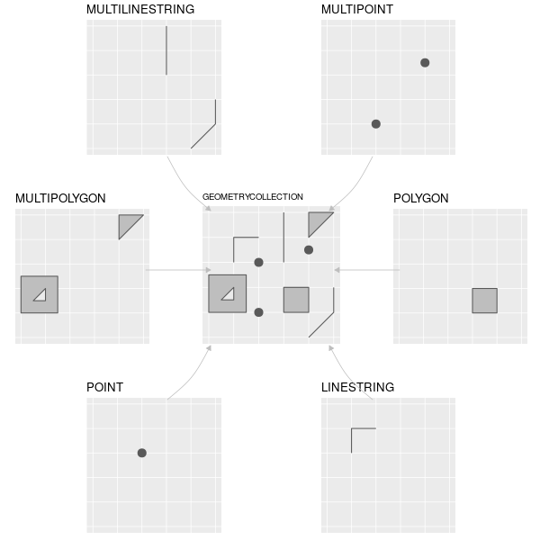

```{r xaringan-themer, include = FALSE}
library(tidyverse)
library(sf)
library(xaringan)
library(xaringanthemer) # devtools::install_github("gadenbuie/xaringanthemer")
duo(
  primary_color = "#1F4257",
  secondary_color = "#F97B64",
  header_font_google = google_font("Josefin Sans"),
  text_font_google   = google_font("Montserrat", "300", "300i"),
  code_font_google   = google_font("Droid Mono")
)

hook_source <- knitr::knit_hooks$get('source')
knitr::knit_hooks$set(source = function(x, options) {
  x <- stringr::str_replace(x, "^[[:blank:]]?([^*].+?)[[:blank:]]*#<<[[:blank:]]*$", "*\\1")
  hook_source(x, options)
})
```

## Les données spatiales dans R

Deux formats de données spatiales coexistent :
  - `sp`, le format le plus ancien et répendu
  - `sf`, un format plus récent, puissant, mais pas encore universel
  
.pull-left[
.smaller[
```{r, message = FALSE}
library(rgdal)
library(sp)
iris_Paris_sp <- readOGR("data/IRIS_Paris_L93.shp",
                         stringsAsFactors = FALSE)
```
]


]

.pull-right[
.smaller[
```{r}
library(sf)
iris_Paris_sf <- st_read("data/IRIS_Paris_L93.shp",
                         stringsAsFactors = FALSE)
str(iris_Paris_sf)
```
]
]

---
## Les données spatiales dans R

.pull-left[
.smaller[
```{r}
plot(iris_Paris_sp)
```
]
]


.pull-right[
.smaller[
```{r}
plot(iris_Paris_sf)
```
]
]

---
## Les données spatiales dans R

On va se contenter de mobiliser le *package* `sf`, qui permet une manipulation d'objets simples, semblables à des `data.frame`/`tibbles`.

**N.B.** : Pour une très grande majorité d'opérations, `sf` suffit. Il peut toutefois être nécessaire de passer de `sf` à `sp` dès lors qu'on souhaite utiliser des fonctions spatiales avancées, par exemple pour mobiliser des méthodes d'analyse spatiale.


---
## `sf` : Les *Simples Features*

.small[
.center[


R. Lovelace, J. Nowosad & J. Muenchow (2018), Geocomputation with R - https://geocompr.robinlovelace.net/
]
]

---
## `sf` : Structure d'un objet `sf`

.small[
```{r}
iris_Paris_sf
```
]

- $\rightarrow$ Un `data.frame`, doté d'une colonne de `geometry` et d'un **système de coordonnées/projection**.

---
## Lecture de fichiers géographiques

#### Toutes les fonctions de `sf` s'inspirent de la syntaxe des fonctions `PostGIS` : `st_OPERATION` :

- Lecture d'un shapefile
.small[
```{r}
communesIDF <- st_read(dsn = "data/IRIS_Paris_L93.shp", 
                       stringsAsFactors = FALSE) # Comme pour la lecture des data.frame
```
]
---
## Projections / transformations

#### Comme dans tout SIG, le système de projection (`st_crs`) est récuperé à la lecture d'un objet :

.small[
```{r}
st_crs(communesIDF)
```
]

Ici, le "code de projection" est bien reconnu, mais le code EPSG n'est pas renseigné. On va le spécifier pour clarifier (même si ce n'est pas utile) :

.small[
```{r}
communesIDF <- communesIDF %>%
  st_set_crs(2154) # SRID/EPSG du Lambert 93
head(communesIDF)
```
]

---
## Projections / transformations

#### On peut re-projeter un objet `sf` avec la fonction `st_transform(SRID/CRS)` :

.pull-left[
.small[
```{r}
communesIDF %>%
  select(geometry) %>% # Lambert 93
  plot()
```
]
]

.pull-right[
.small[
```{r}
GallPeters <- "+proj=cea +lon_0=0 +lat_ts=45 \
  +x_0=0 +y_0=0 +ellps=WGS84 +units=m +no_defs"
communesIDF %>%
  select(geometry) %>%
  st_transform(crs = GallPeters) %>% #<<
  plot()
```
]
]

---
## Visualisation exploratoire : `plot()`

On peut utiliser la fonction de base `plot()`, qui affiche alors l'ensemble des attributs du jeu de données :

.small[
```{r, fig.width = 12, fig.height = 5}
plot(communesIDF)
```
]

---
## Visualisation exploratoire : `plot()`

Pour "cartographier" le contenu d'une seule variable :

.small[
```{r, fig.width = 12, fig.height = 5}
plot(communesIDF["Nom_Com"])
```
]

---
## Visualisation exploratoire : `mapview`

Le *package* `mapview` permet de mener rapidement une exploration des données spatiales et attributaires :

.small[
```{r, message = FALSE, fig.width=10, fig.height = 5}
library(mapview) # install.packages("mapview")
mapview(communesIDF)
```
]

---
## Visualisation exploratoire : `mapview`

Le *package* `mapview` permet de mener rapidement une exploration des données spatiales et attributaires.

On peut aussi spécifier un attribut à observer avec l'instruction `zcol` :

.small[
```{r, message = FALSE, fig.width=10, fig.height = 5}
mapview(communesIDF, zcol = "Nom_Com")
```
]

---
## Opérations attributaires

Comme l'objet `sf` est fondamentalement un `data.frame`, on peut lui appliquer les manipulations vues hier : filtrage (`filter`), réductions de variables (`select`), renommage de variables (`rename`) et création/modification de variables (`mutate`) :

.small[
```{r, fig.width=11, fig.height = 3.5}
communesIDF %>%
  select(DepCom, DComIris) %>% # La sélection de la colonne `geometry` est implicite #<<
  mutate(ARRONDISSEMENT = as.numeric(DepCom) - 100) %>% #<<
  filter(ARRONDISSEMENT >= 75001, ARRONDISSEMENT <= 75007) %>%#<<
  mapview(zcol = "ARRONDISSEMENT")
```
]

---
## Agrégations

Comme avec un `tibble`, on peut réaliser des opérations d'agrégation.
La géométrie est alors, elle-aussi, agrégée en conséquence :

.small[
```{r}
arrondissements_Paris <- communesIDF %>%
  group_by(DepCom) %>%
  summarise()

plot(arrondissements_Paris)
```
]

---
## Jointures attributaires

Comme pour tous les `data.frame`, on peut réaliser des jointures attributaires :

.smaller[
```{r}
joinData <- readRDS("dans_ma_rue_clean.RDS") %>%
  group_by(CODE_POSTAL, ANNEE_DECLARATION) %>%
  summarise(NbIncidents = n()) %>%
  ungroup()

donnees_incidents <- arrondissements_Paris %>%
  mutate(CODGEO = as.character(as.numeric(DepCom) - 100)) %>%
  left_join(joinData, by = c("CODGEO" = "CODE_POSTAL")) #<<

incidents2013 <- filter(donnees_incidents, ANNEE_DECLARATION == 2013)
incidents2017 <- filter(donnees_incidents, ANNEE_DECLARATION == 2017)

commonBreaks <- joinData %>%
  filter(ANNEE_DECLARATION %in% c(2013, 2017)) %>%
  pull(NbIncidents) %>%
  quantile(probs = seq(from = 0, to = 1, by = 0.1))
```

.pull-left[
```{r, fig.height = 3.5}
plot(incidents2013[,"NbIncidents"],
     main = "Incidents 2013",
     breaks = commonBreaks)
```
]

.pull-right[
```{r, fig.height = 3.5}
plot(incidents2017[,"NbIncidents"],
     main = "Incidents 2017",
     breaks = commonBreaks)
```
]
]
---
## Jointures spatiales

Les objets `sf` sont des objets spatiaux, on peut donc aussi effectuer des jointures spatiales (entre deux objets `sf`) :

- Conversion du jeu de données "Dans ma Rue" en objet spatial avec la fonction `st_as_sf` :

.small[
```{r}
dmr_spatial <- readRDS("dans_ma_rue_clean.RDS") %>%
  filter(ANNEE_DECLARATION %in% c(2013, 2017)) %>%
  st_as_sf(coords = c("Long", "Lat"), crs = 4326) %>% #<<
  st_transform(2154) # Pour une opération géométrique, les objets doivent avoir le même SRID
```
]

- Jointure spatiale pour récuperer les IRIS contenant les points :

.small[
```{r}
dmr_augmente <- dmr_spatial %>%
  st_join(communesIDF %>% select(DComIris), join = st_within) #<<
```

.pull-left[
```{r blob, eval = FALSE}
dmr_augmente %>%
  group_by(DComIris, ANNEE_DECLARATION) %>%
  summarise(NbIncidents = n()) %>%
  ungroup() %>%
  head()
```
]
]
.smaller[
.pull-right[
```{r, eval = TRUE, echo = FALSE, ref.label="blob"}
```
]
]


---
## Opérations spatiales


---
## Opérations spatiales
st_*

---
## Cartographie exploratoire : `mapview`

---
## Cartographie statique : `ggplot2`

ggplot2 + geom_sf

---
## Cartographie statique : `cartography`

cartography

---
## Cartographie dynamique : `leaflet`


---
## Un peu d'analyse spatiale ?

