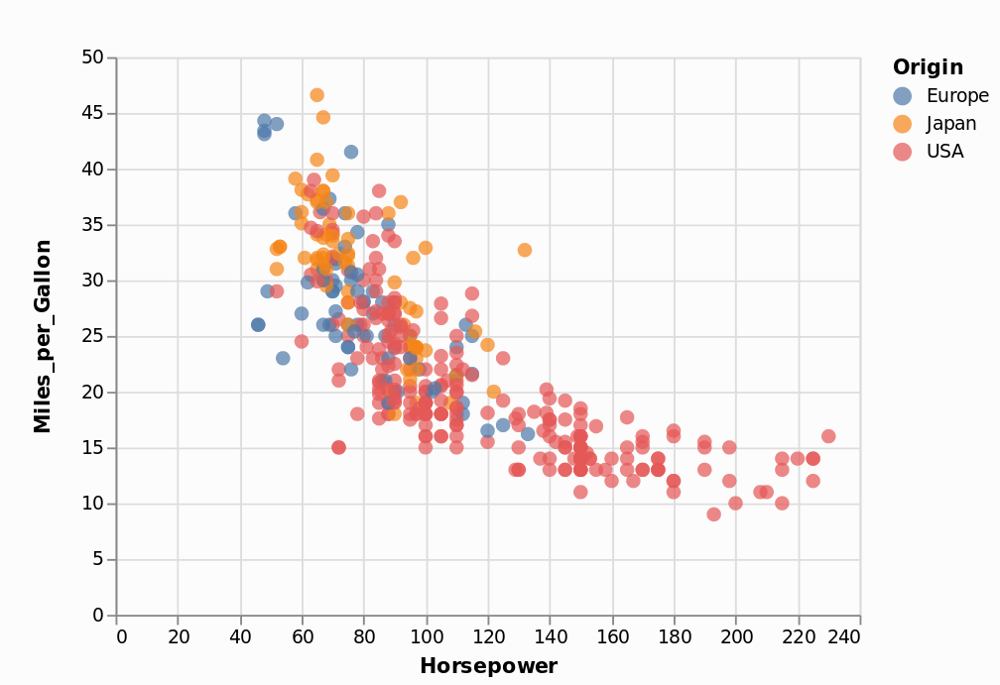

```{r xaringan-themer, include = FALSE}
library(tidyverse)
library(xaringan)
library(xaringanthemer) # devtools::install_github("gadenbuie/xaringanthemer")
duo(
  primary_color = "#1F4257",
  secondary_color = "#F97B64",
  header_font_google = google_font("Josefin Sans"),
  text_font_google   = google_font("Montserrat", "300", "300i"),
  code_font_google   = google_font("Droid Mono")
)
library(knitr)
opts_chunk$set(cache = TRUE,
               cache.lazy = FALSE)
hook_source <- knitr::knit_hooks$get('source')
knitr::knit_hooks$set(source = function(x, options) {
  x <- stringr::str_replace(x, "^[[:blank:]]?([^*].+?)[[:blank:]]*#<<[[:blank:]]*$", "*\\1")
  hook_source(x, options)
})

```


## La *Grammar of Graphics*
Conceptualisée par Leland Wilkinson (2006 [1999])

.pull-left[

]
.pull-right[

]
.center[

]

---
## La *Grammar of Graphics*

#### VegaLite (JavaScript) 
.small[
```
{
  "$schema": "https://vega.github.io/schema/vega-lite/v2.json",
  "data": {"url": "data/cars.json"},
  "mark": "point",
  "encoding": {
    "x": {"field": "Horsepower", "type": "quantitative"},
    "y": {"field": "Miles_per_Gallon", "type": "quantitative"},
    "color": {"field": "Origin", "type": "nominal"}
  }
}
```
]
.center[

]

---
## La *Grammar of Graphics*

#### Altair (Python)
.small[
```
import altair as alt

alt.Chart(cars).mark_circle(size=60).encode(x='Horsepower', y='Miles_per_Gallon', color='Origin')
```
]
.center[

]

---
## La *Grammar of Graphics*

#### ggplot2 (R)
.small[
```
library(ggplot2)

ggplot(cars) +
  geom_point(aes(x = Horsepower, y = Miles_per_Gallon, color = Origin))
```
]
.center[

]

---
## `ggplot2` : une implémentation de la *grammar of graphics*

.small[
Healy, K. (2018). Data Visualization: A Practical Introduction. S.l.: Princeton University Press. http://socviz.co/

]

---
## `ggplot2` : une implémentation de la *grammar of graphics*
Décrire la syntaxe d'un graphique à l'aide d'une grammaire composée d'éléments atomiques :

- Des données (`data`)
- Des objets géométriques (point, ligne, rectangle, barre etc.) (`geom_*`)
    - Un *mapping* entre les données et les "esthétiques" géométriques correspondantes (*aesthetics*, `aes()`)
- Des échelles pour définir les étendues et transformations de l'espace du graphique (`scales_`)
- Un système de coordonnées pour définir le lien entre les échelles (`coord_`)
- Des éléments d'habillage : textes (*labels*, `labs`) et légendes (*guides*, `guides`)
- Éventuellement, des éléments de décomposition des graphiques, les `facets`
    
Tous ces éléments s'accumulent, comme des propriétés supplémentaires, via l'opérateur `+`
    
---
## Les données

- Tout graphique `ggplot2` doit commencer par un appel aux données :
.small[
```{r, echo = FALSE, message = FALSE}
library(tidyverse)
```
```{r, fig.show='hide', message = FALSE}
library(ggplot2) # ou library(tidyverse)
df_dmr_spatialise <- readRDS(file = "dans_ma_rue_clean.RDS")
ggplot(data = df_dmr_spatialise)
```
]

- Les données doivent être structurées de manière **tidy**, dans un `data.frame` (ou un `tibble`) :
    - 1 ligne = 1 individu
    - 1 colonne = 1 variable homogène et cohérente
      - $\rhd$ On privilégie des données au format **long**
      
- Ex. pour stocker des données temporelles :
.pull-left[
.small[
|Ville|CP|Pop1999|Pop2011|
|------|---|---|---|
|Paris|75000|2125|2250|
|Lyon|69000|445|491|
|Marseille|13000|796|851|
]
]


.pull-right[
.small[
|Ville|CP|Annee|Population|
|------|---|---|---|
|Paris|75000|1999|2125|
|Paris|75000|2011|2250|
|Lyon|69000|1999|445|
|Lyon|69000|2011|491|
|Marseille|13000|1999|796|
|Marseille|13000|2011|851|
]
]
---
## Les géométries

- Le composant de base des graphiques : quelle géométrie donner à chaque couche (*layer*) de données ?
#### https://ggplot2.tidyverse.org/reference/index.html#section-layer-geoms

.pull-left[

]

.pull-right[

]

---
## Les géométries

- Une liste complète dans la [*cheatsheet* de ggplot2](https://www.rstudio.com/resources/cheatsheets/#ggplot2)
.center[

]
---
## Les *aesthetics*

- Chaque géométrie comporte des propriétés, génériques (`x`, `y`, `colour`...) ou spécifiques (`linetype`, `shape`, `xmin`...) qui doivent être rapportées (avec un **mapping**) à des variables : ce sont les "esthétiques" (`aes`)

- Ex. : une géométrie de type ponctuelle (`geom_point`) requiert au moins des coordonnées (`x` et `y`), et peut être enrichie avec des propriétés spécifiques (`alpha`, `color`, `fill`, `shape`, `size`, `stroke`) :

.small[
.pull-left[
```{r plot-point, eval=FALSE}
pointData <- df_dmr_spatialise %>%
  filter(
    TYPE == "Problème sur un chantier"
    )

ggplot(pointData) +
  geom_point(aes(x = Long, #<<
                 y = Lat, #<<
                 color = CODE_POSTAL)) #<<
```
]
]

.pull-right[
```{r plot-label-out, ref.label="plot-point", echo=FALSE}
```
]

---
## Les *aesthetics*

- Chaque géométrie comporte des propriétés, génériques (`x`, `y`, `colour`...) ou spécifiques (`linetype`, `shape`, `xmin`...) qui doivent être rapportées (avec un **mapping**) à des variables : ce sont les "esthétiques" (`aes`)

- Ex. : une géométrie de type ponctuelle (`geom_point`) requiert au moins des coordonnées (`x` et `y`), et peut être enrichie avec des propriétés spécifiques (`alpha`, `color`, `fill`, `shape`, `size`, `stroke`)

- On peut aussi définir des propriétés "globales", qui ne dépendront pas du contenu du jeu de données :

.small[
.pull-left[
```{r plot-size, eval=FALSE}
pointData <- df_dmr_spatialise %>%
  filter(
    TYPE == "Problème sur un chantier"
    )

ggplot(pointData) +
  geom_point(aes(x = Long,
                 y = Lat,
                 color = CODE_POSTAL),
             size = 3,#<<
             alpha = .2)#<<
```
]
]

.pull-right[
```{r plot-label-out-2, ref.label="plot-size", echo=FALSE}
```
]

---
## Les *aesthetics*

- Chaque géométrie comporte des propriétés, génériques (`x`, `y`, `colour`...) ou spécifiques (`linetype`, `shape`, `xmin`...) qui doivent être rapportées (avec un **mapping**) à des variables : ce sont les "esthétiques" (`aes`)

- Ex. : une géométrie de type "colonne" (`geom_col`) requiert au moins des coordonnées (`x` et `y`), et peut être enrichie avec des propriétés spécifiques (`x`, `y`, `alpha`, `color`, `fill`, `group`,
`linetype`, `size`, `position`)

.small[
.pull-left[
```{r plot-scale, eval=FALSE}
colData <- df_dmr_spatialise %>%
  filter(
    TYPE == "Problème sur un chantier"
    ) %>%
  group_by(CODE_POSTAL,
           ANNEE_DECLARATION) %>%
  summarise(NbProblemes = n())

ggplot(colData) +
  geom_col(aes(x = CODE_POSTAL,
               y = NbProblemes,
               fill = ANNEE_DECLARATION,#<<
               group = ANNEE_DECLARATION),#<<
           position = "dodge") #<<
```
]
]

.pull-right[
```{r plot-label-out-3, ref.label="plot-scale", echo=FALSE}
```
]

---
## Les échelles

- Quand on veut modifier la manière dont les axes sont conçus, on peut jouer sur les **échelles** (`scale_`)

- Par exemple, pour choisir une échelle logarithmique pour les ordonnées du graphique précédent :


.small[
.pull-left[
```{r plot-scale2, eval=FALSE}
colData <- df_dmr_spatialise %>%
  filter(
    TYPE == "Problème sur un chantier"
    ) %>%
  group_by(CODE_POSTAL,
           ANNEE_DECLARATION) %>%
  summarise(NbProblemes = n())

ggplot(colData) +
  geom_col(aes(x = CODE_POSTAL,
               y = NbProblemes,
               fill = ANNEE_DECLARATION,
               group = ANNEE_DECLARATION),
           position = "dodge") +
  scale_y_log10() #<<
```
]
]

.pull-right[
```{r plot-label-out-4, ref.label="plot-scale2", echo=FALSE}
```
]

---
## Les échelles

- Quand on veut modifier la manière dont les axes sont conçus, on peut jouer sur les **échelles** (`scale_`)

- Par exemple, pour choisir une échelle logarithmique pour les ordonnées du graphique précédent

- Et pour modifier l'échelle de couleurs :


.smaller[
.pull-left[
```{r plot-scale3, eval=FALSE}
colData <- df_dmr_spatialise %>%
  filter(
    TYPE == "Problème sur un chantier"
    ) %>%
  group_by(CODE_POSTAL,
           ANNEE_DECLARATION) %>%
  summarise(NbProblemes = n())

ggplot(colData) +
  geom_col(aes(x = CODE_POSTAL,
               y = NbProblemes,
               fill = as.character(ANNEE_DECLARATION),
               group = as.character(ANNEE_DECLARATION)),
           position = "dodge") +
  scale_y_log10() + #<<
  scale_fill_brewer(palette = "Greens", direction = -1) #<<
```
]
]

.pull-right[
```{r plot-label-out-5, ref.label="plot-scale3", echo=FALSE}
```
]
---
## Les coordonnées

- On l'a vu avec les "cartes" de répartition, `ggplot2` affiche un graphique en maximisant l'espace disponible pour chaque axe : quand les rapports entre les coordonnées `x` et `y` ont un sens, il faut l'expliciter avec les `coord_` :

.smaller[
```{r}
pointData <- df_dmr_spatialise %>%  filter( TYPE == "Problème sur un chantier")
```
]

.pull-left[
.smaller[
```{r}
ggplot(pointData) +
  geom_point(aes(x = Long, y = Lat,
                 color = CODE_POSTAL),
             size = 3, alpha = .2) +
  coord_fixed(ratio = 1) # On fixe 1x = 1y #<<
```
]
]

.pull-right[
.smaller[
```{r, fig.show='hold'}
ggplot(pointData) +
  geom_point(aes(x = Long, y = Lat,
                 color = CODE_POSTAL),
             size = 3, alpha = .2) +
  coord_map(projection = "mercator") #<<
# ratio x/y selon la projection de Mercator #<<
```
]
]

---
## Habillage : textes

- Par défaut, les textes (titres des axes etc.) prennent comme valeur automatique le nom des variables qui leurs sont attribuées.

- On peut modifier tous ces éléments, afin d'habiller correctement les graphiques produits, avec l'instruction `labs` (*labels*) :

.smaller[

```{r, fig.height=2.75}
ggplot(pointData) +
  geom_point(aes(x = Long, y = Lat, color = CODE_POSTAL), size = 3, alpha = .2) +
  coord_map(projection = "mercator") +
  labs(title = 'Incidents déclarés à Paris entre 2012 et 2018',#<<
      subtitle = 'Incidents de type "Problème sur un chantier"',#<<
      caption = 'Sources : Données "Dans ma Rue", Paris OpenData, 2018',#<<
      x = "Longitude", y = "Latitude")#<<
```
]

---
## Habillage : légendes

- On peut modifier et désactiver les légendes directement depuis les échelles (`scales`) correspondantes.

.smaller[

```{r, fig.height=3.75}
ggplot(pointData) +
  geom_point(aes(x = Long, y = Lat, color = CODE_POSTAL), size = 3, alpha = .2) +
  coord_map(projection = "mercator") +
  labs(title = 'Incidents déclarés à Paris entre 2012 et 2018',
      subtitle = 'Incidents de type "Problème sur un chantier"',
      caption = 'Sources : Données "Dans ma Rue", Paris OpenData, 2018',
      x = "Longitude", y = "Latitude") +
  scale_color_discrete(guide = FALSE) + #<<
  scale_x_continuous(labels = NULL, breaks = NULL, minor_breaks = NULL) + #<<
  scale_y_continuous(labels = NULL, breaks = NULL, minor_breaks = NULL) #<<
```
]
---
## Décomposer un graphique : les *facets*

On peut "décomposer" un graphique (en *small multiples*) avec les instructions `facet_` :

- `facet_wrap(~VARIABLE)` : décompose le graphique en autant de modalités que contenues dans `VARIABLE`. On règle leur agencement avec les arguments `nrow` (nombre de lignes) et/ou `ncol` (nombre de colonnes).

.small[

```{r, eval = FALSE, fig.height=3, fig.width=12}
ggplot(pointData) +
  geom_point(aes(x = Long, y = Lat, color = CODE_POSTAL), size = 2, alpha = .2) +
  coord_map(projection = "mercator") +
  labs(title = 'Incidents déclarés à Paris entre 2012 et 2018',
      subtitle = 'Incidents de type "Problème sur un chantier"',
      caption = 'Sources : Données "Dans ma Rue", Paris OpenData, 2018',
      x = "Longitude", y = "Latitude") +
  scale_color_discrete(guide = FALSE) +
  scale_x_continuous(labels = NULL, breaks = NULL, minor_breaks = NULL) +
  scale_y_continuous(labels = NULL, breaks = NULL, minor_breaks = NULL) +
  facet_wrap(~ANNEE_DECLARATION, nrow = 1) #<<
```
]

---
## Décomposer un graphique : les *facets*

On peut "décomposer" un graphique (en *small multiples*) avec les instructions `facet_` :

- `facet_wrap(~VARIABLE)` : décompose le graphique en autant de modalités que contenues dans `VARIABLE`. On règle leur agencement avec les arguments `nrow` (nombre de lignes) et/ou `ncol` (nombre de colonnes).

.small[

```{r, fig.height=3, fig.width=12, echo = FALSE}
ggplot(pointData) +
  geom_point(aes(x = Long, y = Lat, color = CODE_POSTAL), size = 2, alpha = .2) +
  coord_map(projection = "mercator") +
  labs(title = 'Incidents déclarés à Paris entre 2012 et 2018',
      subtitle = 'Incidents de type "Problème sur un chantier"',
      caption = 'Sources : Données "Dans ma Rue", Paris OpenData, 2018',
      x = "Longitude", y = "Latitude") +
  scale_color_discrete(guide = FALSE) +
  scale_x_continuous(labels = NULL, breaks = NULL, minor_breaks = NULL) +
  scale_y_continuous(labels = NULL, breaks = NULL, minor_breaks = NULL) +
  facet_wrap(~ANNEE_DECLARATION, nrow = 1) #<<
```
]

---
## Décomposer un graphique : les *facets*

On peut "décomposer" un graphique (en *small multiples*) avec les instructions `facet_` :

- `facet_grid(VARIABLE1~VARIABLE2)` : décompose le graphique en un croisement des modalités contenues dans `VARIABLE1` et `VARIABLE2`.

.small[

```{r, fig.height=3, fig.width=12, eval = FALSE}
ggplot(pointData %>% filter(!is.na(SOUSTYPE))) +
  geom_point(aes(x = Long, y = Lat, color = CODE_POSTAL), size = 2, alpha = .2) +
  coord_map(projection = "mercator") +
  labs(title = 'Incidents déclarés à Paris entre 2012 et 2018',
      subtitle = 'Incidents de type "Problème sur un chantier"',
      caption = 'Sources : Données "Dans ma Rue", Paris OpenData, 2018',
      x = "Longitude", y = "Latitude") +
  scale_color_discrete(guide = FALSE) +
  scale_x_continuous(labels = NULL, breaks = NULL, minor_breaks = NULL) +
  scale_y_continuous(labels = NULL, breaks = NULL, minor_breaks = NULL) +
  facet_grid(SOUSTYPE~ANNEE_DECLARATION) #<<
```
]

---
## Décomposer un graphique : les *facets*

On peut "décomposer" un graphique (en *small multiples*) avec les instructions `facet_` :

- `facet_grid(VARIABLE1~VARIABLE2)` : décompose le graphique en un croisement des modalités contenues dans `VARIABLE1` et `VARIABLE2`.

.small[

```{r, fig.height=5, fig.width=12, echo = FALSE}
ggplot(pointData %>% filter(!is.na(SOUSTYPE))) +
  geom_point(aes(x = Long, y = Lat, color = CODE_POSTAL), size = 2, alpha = .2) +
  coord_map(projection = "mercator") +
  labs(title = 'Incidents déclarés à Paris entre 2012 et 2018',
      subtitle = 'Incidents de type "Problème sur un chantier"',
      caption = 'Sources : Données "Dans ma Rue", Paris OpenData, 2018',
      x = "Longitude", y = "Latitude") +
  scale_color_discrete(guide = FALSE) +
  scale_x_continuous(labels = NULL, breaks = NULL, minor_breaks = NULL) +
  scale_y_continuous(labels = NULL, breaks = NULL, minor_breaks = NULL) +
  facet_grid(SOUSTYPE~ANNEE_DECLARATION) #<<
```
]

---
## Superposer des couches graphiques

`ggplot2` permet d'empiler des couches de représentations portant sur les mêmes données (représentations différentes) ou sur d'autres jeux de données (si tant est qu'ils se situent dans les mêmes étendues graphiques).
Comme pour tous les éléments de `ggplot`, cela se fait avec l'opérateur `+` :

.pull-left[
.small[
```{r}
maCarte <- ggplot(pointData) +
  geom_point(aes(x = Long, y = Lat)) +
  coord_map(projection = "mercator")
maCarte
```
]
]

.pull-right[
.small[
```{r}
maCarte +
  geom_density2d(aes(x = Long, y = Lat)) #<<
```
]
]

---
## Superposer des couches graphiques

- **N.B.** : l'ordre d'ajout des couches est important : les dernières couches ajoutées seront positionnées "au dessus" des couches précédentes :

.pull-left[
.small[
```{r}
ggplot(pointData) +
  aes(x = Long, y = Lat) + 
  geom_point(colour = "white", alpha = .4) + #<<
  stat_density_2d(aes(fill = stat(level)), #<<
                  geom = "polygon") + #<<
  coord_map(projection = "mercator")
```
]
]

.pull-right[
.small[
```{r}
ggplot(pointData) +
  aes(x = Long, y = Lat) + 
  stat_density_2d(aes(fill = stat(level)), #<<
                  geom = "polygon") + #<<
  geom_point(colour = "white", alpha = .4) + #<<
  coord_map(projection = "mercator")
```
]
]

---
## Composer une planche de graphiques

- Avec le *package* `patchwork`, on peut facilement agencer différents graphiques

.smaller[

```{r, eval = TRUE}
library(patchwork) # devtools::install_github("thomasp85/patchwork")
```

```{r, fig.height = 3}
carteData <- df_dmr_spatialise %>%
  filter(TYPE %in% c("Propreté", "Voirie et déplacements", "Éclairage / Électricité")) %>%
  filter(ANNEE_DECLARATION >= 2015) %>%
  mutate(TRIMESTRE = paste(ANNEE_DECLARATION, TRIMESTRE_DECLARATION, sep="-")) %>%
  arrange(TRIMESTRE, TYPE)

maCarte <- ggplot(carteData) +
  geom_point(aes(Long, Lat, colour = TYPE), size = .5, alpha = .3) +
  facet_grid(ANNEE_DECLARATION~TYPE) +
  coord_map(projection = "mercator") +
  scale_colour_discrete(guide = FALSE)

maCarte
```
]
---
## Composer une planche de graphiques

.smaller[
```{r,  fig.height = 3}
evolData <- carteData %>%
  group_by(TRIMESTRE, TYPE) %>%
  summarise(NbIncidents = n())

evolNombre <- ggplot(evolData) +
  geom_line(aes(TRIMESTRE, NbIncidents, colour = TYPE, group = TYPE), size = 2) +
  facet_wrap(~TYPE, nrow = 1) +
  scale_colour_discrete(guide = FALSE)

evolNombre
```
]

---
## Composer une planche de graphiques

.smaller[
```{r, fig.height = 3}
arrdtData <- carteData %>%
  group_by(ANNEE_DECLARATION, CODE_POSTAL) %>%
  summarise(NbIncidents = n()) %>%
  ungroup() %>%
  mutate(ANNEE_DECLARATION = as.character(ANNEE_DECLARATION))

evolArrdt <- ggplot(arrdtData) +
  geom_col(aes(CODE_POSTAL, NbIncidents, fill = ANNEE_DECLARATION), position = "dodge") +
  scale_fill_viridis_d() +
  theme(legend.position="bottom",
        axis.text.x = element_text(angle = 45, hjust = 1)) 

evolArrdt
```
]

---
## Composer une planche de graphiques
.small[
```{r fig.width=13, fig.height=7}
(maCarte | (evolNombre / evolArrdt)) #<<
```
]

---
class: inverse, center, middle

### Un peu de pratique ! <br/>Proposer des représentations graphiques, à partir du jeu de données "Dans ma Rue", permettant de saisir l'évolution, dans le temps et dans l'espace, des signalements d'anomalies.

#### Ne pas oublier de se référer à la *cheatsheet* : <span>htt</span>ps://www.rstudio.com/resources/cheatsheets/#ggplot2
